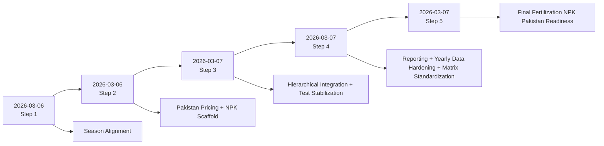
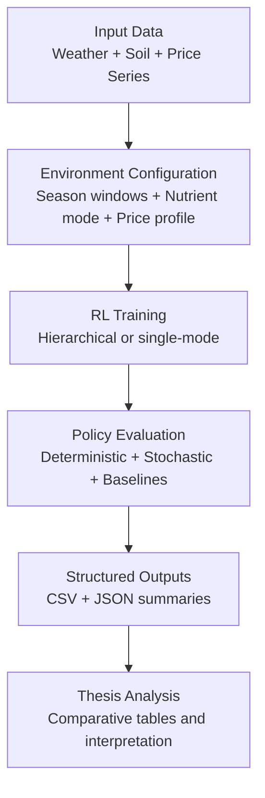

# Improvements Quick Reference (Tables and Visual Aids)

## 1. Timeline of Improvements

## 2. Before vs After Summary Table

| Dimension | Before | After |
|---|---|---|
| Crop-season realism | Crop timing not explicitly constrained by Pakistan windows | Crop planning can enforce Pakistan sowing windows |
| Fertilizer economics | Mostly N-focused with legacy assumptions | Full NPK costing with Pakistan-oriented profiles |
| Decision integration | Crop planning and fertilization mostly separate | Unified hierarchical RL setup for annual + weekly decisions |
| Reporting depth | Limited explainability for thesis narratives | Weekly nutrient logs, yearly decisions, compliance metrics |
| Benchmark comparability | Inconsistent run summaries | Standardized RL-vs-baseline summaries and matrix outputs |
| Deployment readiness | Partial | End-to-end NPK Pakistan defaults and validated matrix commands |

## 3. Contribution Typology Matrix

| Step | Contribution Type | Primary Impact |
|---|---|---|
| Step 1 | Domain alignment | Agronomic validity |
| Step 2 | Economic model expansion | Local relevance + nutrient dimensionality |
| Step 3 | Architecture integration | Joint optimization capability |
| Step 4 | Measurement and data engineering | Explainability + reproducibility |
| Step 5 | Operational hardening | Final-run readiness |

## 4. Verification Status Matrix

| Verification Layer | Status | Notes |
|---|---|---|
| Compile checks | PASS | Applied after each major step |
| Targeted unit tests | PASS | Step-specific modules validated |
| Integration tests | PASS | Cross-platform invocation and behavior stabilized |
| Full suite regression | PASS | Final status reached `59 passed, 8 warnings` |
| Dry-run matrix checks | PASS | Command generation verified for hierarchical and baseline scenarios |

## 5. Interpretable Output Artifacts

| Artifact | Purpose | Level |
|---|---|---|
| `weekly_npk_log.csv` | Weekly nutrient action and cost tracing | Intra-season |
| `yearly_crop_decisions.csv` | Strategic crop/window decisions | Annual |
| `season_window_compliance.csv` | Agronomic compliance evidence | Annual compliance |
| `reporting_summary.json` | Aggregated reporting signals | Run-level |
| Standardized summary JSON | Comparable metrics across RL and baselines | Experiment-level |

## 6. End-to-End Process Flow

