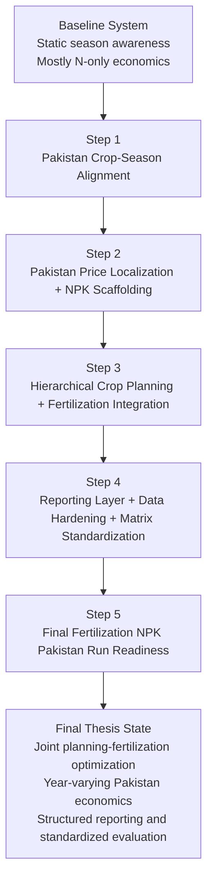
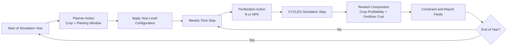
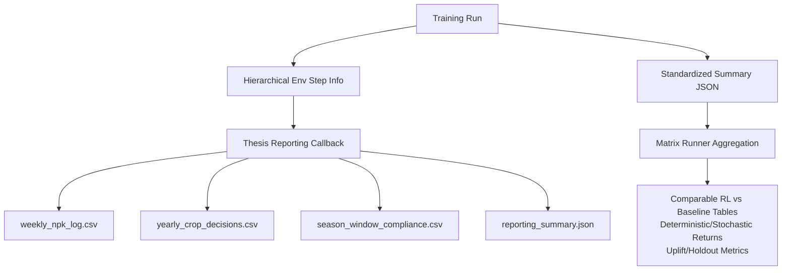

# Thesis Improvements: Comprehensive Academic Documentation

## Document Metadata
- Project: CYCLES GYM Thesis Enhancement Program
- Coverage window: 2026-03-06 to 2026-03-07
- Sources synthesized: `Changes/THESIS_IMPLEMENTATION_01_*.md` through `Changes/THESIS_IMPLEMENTATION_05_*.md`, `Changes/BUG_FIX_LOG.md`

## Abstract
This document formalizes the complete improvement trajectory of the thesis codebase, with emphasis on agronomic realism, economic localization, multi-nutrient decision support, hierarchical reinforcement learning (RL) integration, data robustness, and reproducible evaluation. The implementation progressed through five structured steps. Collectively, these interventions transformed the platform from a predominantly static, nitrogen-centric, and partially siloed workflow into a Pakistan-contextualized, NPK-capable, hierarchically integrated, and thesis-reporting-ready experimental stack.

## 1. Baseline State and Problem Framing
Before the improvement cycle, the system exhibited the following constraints:

1. Crop planning logic had limited contextualization to Pakistan crop-season windows.
2. Economic reward calculation was primarily aligned to legacy assumptions and mostly nitrogen-only fertilizer costing.
3. Crop planning and fertilization optimization were not jointly modeled in a unified decision environment.
4. Reporting artifacts were not sufficiently granular for thesis-grade interpretability (for example, nutrient-wise cost decomposition and season-window compliance).
5. Some platform and integration paths (notably Windows execution and compatibility paths) required stabilization to ensure full reproducibility.

## 2. High-Level Improvement Trajectory

## 3. Detailed Step-Wise Contributions

### 3.1 Step 1: Pakistan Crop-Season Alignment

#### 3.1.1 Problem Statement
Planting recommendations could be generated without explicit enforcement of Pakistan-specific sowing windows, reducing agronomic plausibility.

#### 3.1.2 Technical Intervention
1. Introduced Pakistan crop-calendar utility with crop-window metadata and source mapping.
2. Extended crop-planning environment to support optional calendar-aware behavior.
3. Enhanced `RotationPlanter` to map planning actions to crop-specific day-of-year windows.
4. Preserved fallback behavior for crops lacking configured windows.

#### 3.1.3 Scientific Contribution
This step establishes agronomic validity constraints at decision time, improving external validity of policy recommendations for local deployment narratives.

#### 3.1.4 Validation Evidence
- Compile checks: PASS
- Unit tests on implementers and rewarders: PASS (`9+` related checks across updated sets)
- Backward compatibility preserved by default-off configuration.

---

### 3.2 Step 2: Pakistan Economic Localization and NPK Scaffolding

#### 3.2.1 Problem Statement
Economic optimization was not fully localized and was largely oriented around nitrogen-only modeling.

#### 3.2.2 Technical Intervention
1. Added a profile-based pricing architecture (`us_legacy`, `pakistan_baseline`).
2. Added Pakistan crop price pathways and nutrient price derivations from Pakistan fertilizer references.
3. Added NPK-capable reward pathway (`NPKProfitabilityRewarder`).
4. Added NPK-capable action implementation (`FixedRateNPKFertilizer`) and compatible parsing for scalar/list/dict action formats.
5. Extended Corn environment to support `nutrient_action_mode` with NPK action space.

#### 3.2.3 Scientific Contribution
This step enables a transition from single-nutrient optimization to multi-nutrient resource allocation, which is more consistent with real-world fertilizer management and the thesis objective of realistic cost-sensitive policy optimization.

#### 3.2.4 Validation Evidence
- Compile checks: PASS
- Targeted tests: PASS (`21 passed` on key modules)
- Runtime smoke checks: PASS for both legacy N mode and NPK mode.

---

### 3.3 Step 3: Hierarchical Crop Planning and Fertilization Integration

#### 3.3.1 Problem Statement
Strategic (yearly crop planning) and tactical (within-season fertilization) decisions were not jointly optimized in one environment.

#### 3.3.2 Technical Intervention
1. Added `HierarchicalCropPlanningFertilization` environment.
2. Structured policy interface to include two levels of decisions:
   - annual crop and planting-window decisions,
   - periodic fertilization actions (N or NPK).
3. Integrated hierarchical mode into training entrypoint as opt-in capability.
4. Stabilized cross-platform integration tests by fixing executable invocation, step-return handling, and control-file parity paths.

#### 3.3.3 Scientific Contribution
This step operationalizes multi-scale decision coupling in RL, aligning computational policy structure with real farm management hierarchies.

#### 3.3.4 Validation Evidence
- Integration and regression suites: PASS
- Full test suite at this stage: PASS (`53 passed` then later superseded by higher pass counts after subsequent steps).

#### 3.3.5 Hierarchical Decision Flow

---

### 3.4 Step 4: Reporting Layer, Data Hardening, and Matrix Standardization

#### 3.4.1 Problem Statement
Thesis-grade interpretability required richer reporting artifacts and year-sensitive economics; benchmarking outputs needed standardized comparability.

#### 3.4.2 Technical Intervention
1. Added structured reporting fields in hierarchical environment outputs.
2. Added `HierarchicalThesisReportCallback` to write:
   - `weekly_npk_log.csv`
   - `yearly_crop_decisions.csv`
   - `season_window_compliance.csv`
   - `reporting_summary.json`
3. Added data-building pipeline to generate Pakistan yearly crop and fertilizer nutrient series.
4. Standardized per-run summary JSON and matrix outputs for RL vs baseline comparison.

#### 3.4.3 Scientific Contribution
This step strengthens transparency, traceability, and defensibility by enabling post-hoc interpretability across temporal scales (weekly nutrient behavior and yearly crop strategy) and by enforcing comparable metrics across experiment families.

#### 3.4.4 Validation Evidence
- Targeted tests: PASS
- Full test suite: PASS (`57 passed`)
- Runtime hardening introduced no-tracking pathways and robust fallback behavior in constrained environments.

#### 3.4.5 Reporting and Evaluation Pipeline

---

### 3.5 Step 5: Final Fertilization NPK Pakistan Run Readiness

#### 3.5.1 Problem Statement
Fertilization training defaults and wrappers still needed end-to-end NPK/Pakistan readiness for final thesis runs.

#### 3.5.2 Technical Intervention
1. Enabled full NPK parameter propagation through fertilization wrappers.
2. Updated fertilization training defaults to Pakistan-aligned NPK mode.
3. Added CLI surface for nutrient-mode and channel-level control.
4. Corrected holdout-evaluation environment selection bug.
5. Corrected vectorized MultiDiscrete open-loop action output behavior.
6. Extended matrix runner to include fertilization NPK/Pakistan controls by default.
7. Refreshed Pakistan yearly economic data asset from live source pipeline.

#### 3.5.3 Scientific Contribution
This step closes the implementation-to-experiment gap and produces a thesis-final operational state in which default training behavior is aligned with local economic and nutrient-management assumptions.

#### 3.5.4 Validation Evidence
- Targeted tests: PASS (`17 passed`)
- Full test suite: PASS (`59 passed, 8 warnings`)
- Dry-run matrix validation: PASS
- NPK wrapper smoke check: PASS (`MultiDiscrete([11 11 11])`).

## 4. Cross-Cutting Stabilization and Bug Remediation
The improvement program also included defect correction and runtime robustness hardening:

1. Observation-space bound correction in crop planning environment.
2. Action-change detection and operation-key fixes in implementers.
3. Callback log-path collision fixes.
4. Evaluation unpack mismatch fixes.
5. Dynamic weather-year bounds in fertilization workflow.
6. Cross-platform CYCLES executable invocation fixes for tests.
7. Gym/Gymnasium compatibility adjustments.
8. Test robustness improvements for platform-specific dataframe/string variance.
9. Optional no-tracking execution mode with safe W&B fallback.

These interventions improved internal consistency, reduced execution fragility, and increased reproducibility confidence.

## 5. Capability Progression Matrix

| Capability Dimension | Baseline State | Step Introduced | Final State |
|---|---|---|---|
| Pakistan crop-season realism | Limited/implicit | Step 1 | Explicit crop-window aware planning with fallback |
| Price localization | Legacy-biased | Step 2 | Pakistan profile with yearly series hardening |
| Nutrient model dimensionality | Mostly N-only | Step 2, finalized in Step 5 | Full NPK action/reward support |
| Joint strategic+tactical optimization | Decoupled | Step 3 | Unified hierarchical RL environment |
| Reporting granularity | Coarse | Step 4 | Weekly nutrient logs + yearly decisions + compliance outputs |
| Baseline comparability | Partial | Step 4 | Standardized RL-vs-baseline summary metrics |
| Fertilization final-run defaults | Mixed | Step 5 | Pakistan + NPK defaults for final runs |
| Cross-platform integration stability | Incomplete | Step 3 + bug fixes | Stable Windows-compatible test invocation |
| Runtime robustness without tracking stack | Limited | Step 4 hardening | No-tracking execution path with safe fallbacks |
| End-to-end test confidence | Moderate | Step 3-5 | Full suite passing (`59 passed`) |

## 6. Traceability Matrix (Improvement -> Evidence -> Thesis Value)

| Improvement Cluster | Key Implementation Artifacts | Verification Evidence | Thesis Value Added |
|---|---|---|---|
| Season alignment | Pakistan calendar utility + planner integration | Targeted tests on mapping and fallback behavior | Agronomic plausibility |
| Pakistan economics + NPK scaffold | Pricing profiles, rewarders, implementers, Corn env extension | `21 passed` targeted tests + smoke checks | Local economic validity + multi-nutrient framing |
| Hierarchical integration | New hierarchical env + train entrypoint flags | Integration tests pass + regression preservation | Joint decision optimization |
| Reporting + data hardening | Thesis reporting callback + yearly data builder + matrix standardization | `57 passed` suite + artifact generation | Explainability and reproducible comparison |
| Final fertilization readiness | NPK passthrough wrappers + default config + policy and holdout fixes | `59 passed`, dry-run matrix pass | Final-run operational readiness |

## 7. Evaluation Metric Standardization (Recommended Thesis Definitions)

| Metric | Definition | Interpretation |
|---|---|---|
| Deterministic return | Mean episodic return under deterministic policy rollout | Stability under fixed policy behavior |
| Stochastic return | Mean episodic return under stochastic action sampling | Robustness under policy variance |
| Best baseline return | Highest return among open-loop or predefined baseline strategies | Reference floor/ceiling for comparison |
| Uplift vs baseline | RL return - best baseline return | Net gain attributable to learning |
| Holdout return | Return on evaluation years not used in training | Generalization quality |
| Window compliance rate | Fraction of yearly crop decisions within permitted seasonal windows | Agronomic adherence |
| Nutrient cost decomposition | Per-step and aggregate N/P/K cost contributions | Economic interpretability |

## 8. Methodological Integrity Controls

1. Backward compatibility defaults were preserved during each step where feasible.
2. New features were introduced as opt-in mode switches before default transitions.
3. Validation combined compile checks, targeted tests, integration tests, full-suite regression, and smoke checks.
4. Data pipelines incorporated fallback paths to reduce runtime fragility.
5. Reporting outputs were structured for machine-readability and thesis reproducibility.

## 9. Final Academic Summary
The five-step enhancement trajectory constitutes a coherent progression from baseline capability extension to thesis-final operational readiness. The architecture now supports: (i) agronomically constrained crop planning, (ii) Pakistan-localized and year-varying economic modeling, (iii) full NPK decision pathways, (iv) hierarchical integration of annual and intra-seasonal decisions, and (v) standardized reporting and benchmarking artifacts suitable for transparent scientific communication. The final verification status (`59 passed` tests) supports the claim that these improvements are not only conceptually stronger but also technically stable for dissertation-scale experimentation.

## 10. Suggested Citation Block (for thesis chapter insertion)
Use the following concise framing in your thesis methodology/results chapter:

"The experimental platform was incrementally enhanced through five controlled implementation phases: Pakistan crop-season alignment, Pakistan-localized multi-nutrient economic modeling, hierarchical integration of annual crop planning with weekly fertilization, reporting/data hardening with standardized RL-baseline benchmarking, and final NPK/Pakistan default operationalization. Each phase was validated through compile-time checks, targeted tests, integration tests, and full-suite regression, culminating in a stable test status of 59 passing tests."
