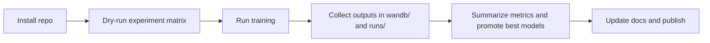

# Overview and Scope

## Project Goal

This repository studies agricultural decision-making with reinforcement learning on top of the CYCLES crop simulator.
The current implementation is framed around cost-aware resource allocation for Pakistan-based weather and soil files.

## What The Repo Actively Supports

- fertilization training with PPO, A2C, and DQN
- crop-planning training with PPO, A2C, and DQN
- consolidated matrix execution through `run_experiments_7_3_2026.py`
- targeted hierarchical reruns through `run_hierarchical_guarded_parallel.py`
- local experiment summaries, train logs, model checkpoints, and normalization statistics

## What The Repo Does Not Claim

- field-validated agronomic recommendations
- production-ready farm decision support
- full irrigation optimization
- multi-field land allocation
- complete multi-resource control beyond the implemented action spaces

## Cleaned Repository Layout

| Path | Purpose |
|---|---|
| `cycles/` | CYCLES executable and simulator inputs |
| `cyclesgym/` | environment, manager, policy, and utility code |
| `experiments/` | domain-specific training and evaluation scripts |
| `runs/` | local outputs created during new runs |
| `docs/` | GitHub-facing documentation |
| `Local Files and Folders/` | archived non-runtime material |

## High-Level Workflow

## Recommended Reading Order

1. [Setup and Usage](02_setup_and_usage.md)
2. [Architecture and Workflows](03_architecture_and_workflows.md)
3. [Reporting and Artifacts](04_reporting_and_artifacts.md)
4. [Model Management](05_model_management.md)
5. [Results Summary and Evidence Positioning](06_results_summary_and_limitations.md)
6. [Contributions vs Original CyclesGym](09_contributions_vs_original_cyclesgym.md)

## Repository Boundary

The public repo should center on the runtime code, the reproducible runners, and the documentation in `docs/`.
Generated outputs, historical W&B folders, and thesis drafting material should stay outside the main narrative even if they remain available in the archive folder for traceability.
