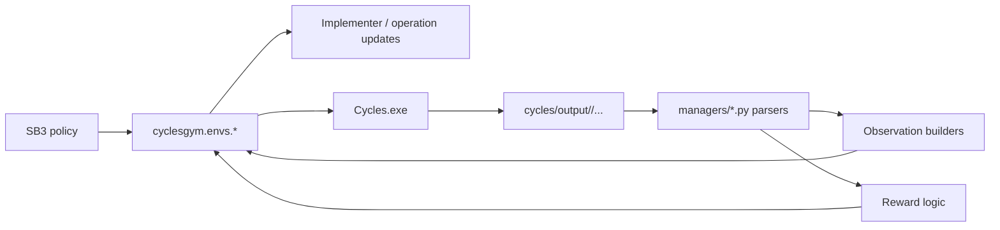
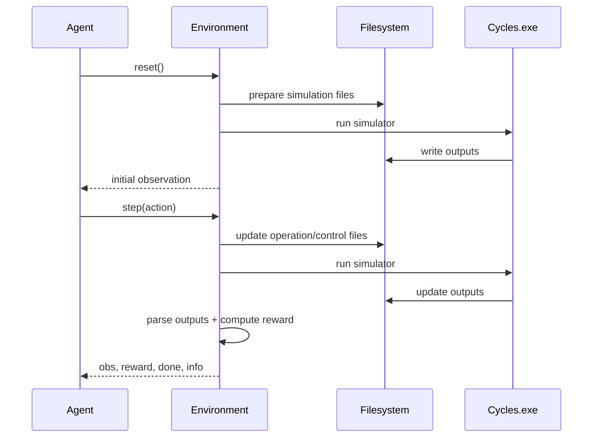
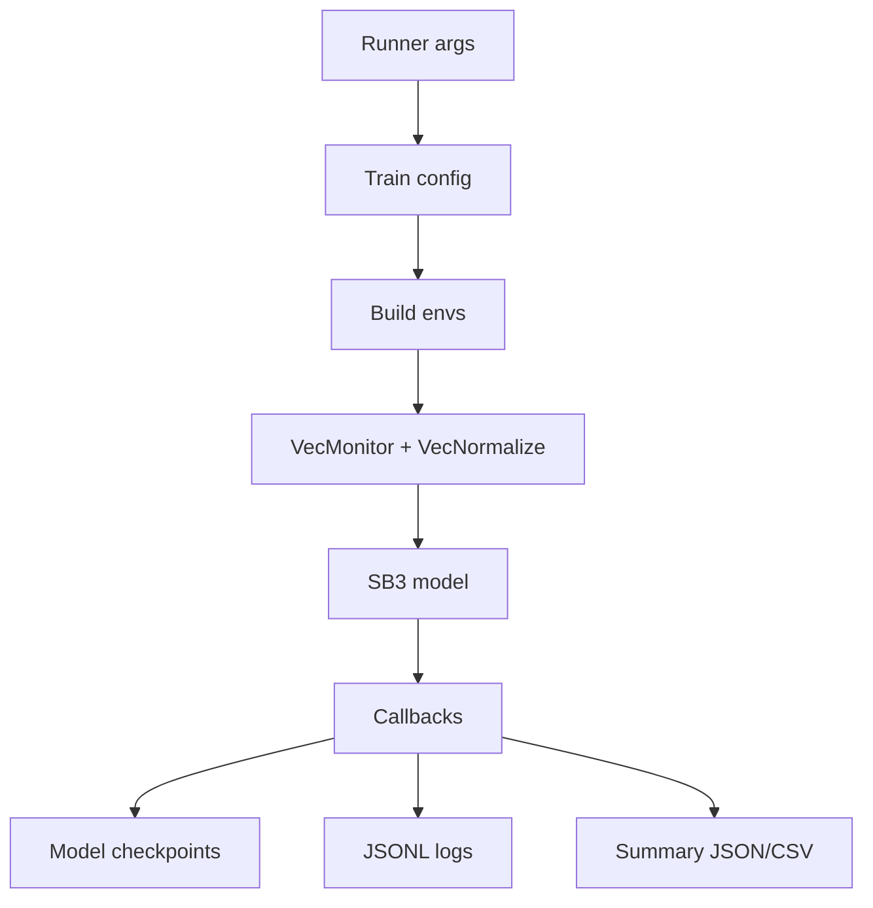

# Architecture and Workflows

## End-to-End Runtime Architecture

## Main Components

| Area | Key Files | Responsibility |
|---|---|---|
| simulator paths | `cyclesgym/utils/paths.py` | project-root and simulator path resolution |
| fertilization env | `cyclesgym/envs/corn.py` | weekly fertilization decision environment |
| crop-planning env | `cyclesgym/envs/crop_planning.py` | yearly crop decision environment |
| hierarchical env | `cyclesgym/envs/hierarchical.py` | yearly crop plus weekly fertilizer joint control |
| weather generation | `cyclesgym/envs/weather_generator.py` | fixed and shuffled weather modes |
| train scripts | `experiments/fertilization/train.py`, `experiments/crop_planning/train.py` | SB3 training, logging, summaries, checkpointing |
| runners | `run_experiments_7_3_2026.py`, `run_hierarchical_guarded_parallel.py` | experiment orchestration |

## Simulation Lifecycle

## Training Workflow

## Active Entry Points

- `run_experiments_7_3_2026.py`: consolidated thesis matrix runner
- `run_hierarchical_guarded_parallel.py`: guarded hierarchical reruns
- `run_all_2.py`: compatibility wrapper with older defaults
- `run_all_experiments.py`: thin compatibility wrapper

## Geographic Defaults

The current code defaults to Pakistan weather and soil inputs.
That makes the repo coherent for the current thesis framing, but it also means claims should stay scoped to the simulator configuration that is actually encoded in the training and environment setup.
