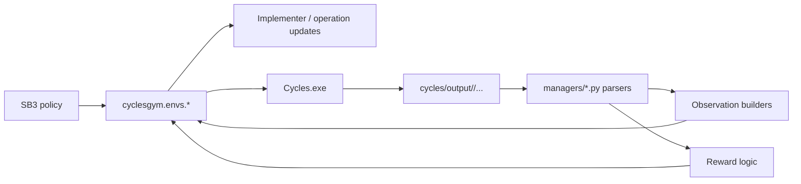
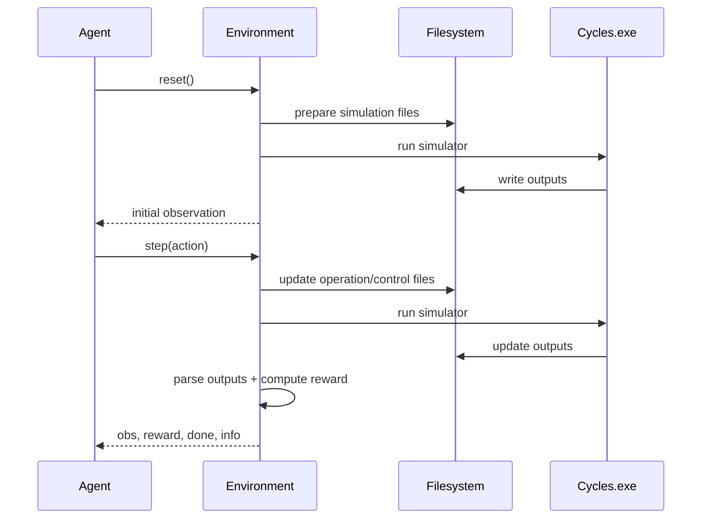

# Architecture and Workflows

## End-to-End Runtime Architecture

## Main Components

| Area | Key Files | Responsibility |
|---|---|---|
| simulator paths | `cyclesgym/utils/paths.py` | project-root and simulator path resolution |
| fertilization env | `cyclesgym/envs/corn.py` | weekly fertilization decisions |
| crop-planning env | `cyclesgym/envs/crop_planning.py` | yearly crop decisions |
| hierarchical env | `cyclesgym/envs/hierarchical.py` | yearly planning + weekly fertilization |
| weather generation | `cyclesgym/envs/weather_generator.py` | fixed/random weather modes |
| training scripts | `experiments/fertilization/train.py`, `experiments/crop_planning/train.py` | SB3 train/eval workflow |
| matrix runners | `run_experiments_7_3_2026.py`, `run_hierarchical_guarded_parallel.py` | orchestration |

## Simulation Lifecycle

## Reporting-Critical Design

The thesis stack deliberately preserves more than scalar reward:

- nutrient-wise costs (`N`, `P`, `K`)
- yearly crop decision traces
- compliance/report fields in `info`
- per-run summary JSON outputs

This is essential for defense interpretability.

## Geographic Defaults

Current defaults are Pakistan-oriented (weather, soil, price profiles). Claims should remain scoped to this configured simulation context.

## Current Methodological Position

Architecture is implementation-complete for the targeted thesis scope, and final comparative claims are backed by completed frozen runs (`final_113` and `final_42_ablation`).
