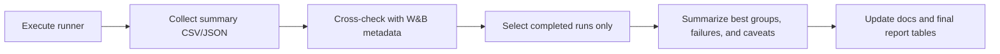

# Reporting and Artifacts

## Purpose

This repository produces two kinds of outputs:

- runtime artifacts needed to resume, inspect, or evaluate experiments
- reporting artifacts needed to summarize finished experiment batches

The final reporting process should always reduce raw outputs into a small set of reviewable summaries before anything is cited in docs or a thesis chapter.

## Artifact Map

| Path | What It Contains | When To Use It |
|---|---|---|
| `wandb/` | tracked run folders, metadata, and checkpoint files | use when W&B tracking is enabled |
| `runs/offline/` | local fallback run folders when `--without-tracking` is used | use for no-W&B runs |
| `runs/experiment_summaries/` | aggregated batch CSVs and per-run summary JSONs | primary reporting source |
| `runs/train_logs/` | JSONL step and rollout logs | debugging and timeline reconstruction |
| `runs/thesis_reports/` | hierarchical per-run report bundles | only for hierarchical reporting |
| `runs/vec_normalize_*.pkl` | observation/reward normalization state | required for evaluation and reuse |

## Final Reporting Workflow

## Source-Of-Truth Priority

1. `runs/experiment_summaries/*.csv` and per-run summary JSON files
2. `wandb/` metadata and run directories
3. `runs/train_logs/*.jsonl` for debugging details
4. `runs/thesis_reports/` for hierarchical branch details

Use the summary CSV and JSON outputs as the primary reporting layer.
Do not build final tables directly from raw checkpoint folders.

## Reporting Checklist For A Finished Batch

1. Confirm the runner completed without silent failures.
2. Open the batch summary CSV in `runs/experiment_summaries/`.
3. Separate successful runs from failed runs.
4. Verify that each result cited in a report has a matching summary JSON and model artifact.
5. Record the exact command, seed, method, domain, and weather mode.
6. Keep failure signatures in the report instead of hiding them.
7. Update `docs/06_results_summary_and_limitations.md` only after the previous steps are done.

## What A Final Report Should Include

- one short paragraph describing the experiment batch
- a table of the best completed configurations
- a failure summary with counts and root-cause labels
- the location of saved checkpoints and normalization files
- clear scope limits for any claims made from the batch

## Public Repo Rule

Commit the code, the docs, and any lightweight static figures you intentionally publish.
Do not commit raw `wandb/` runs, raw `runs/` output trees, or large local experiment dumps as part of the public repo history.
