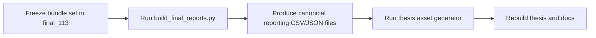

# Reporting and Artifacts

## Purpose

This repository produces two distinct output layers:

- runtime artifacts needed to resume, inspect, or debug experiments
- canonical reporting artifacts used for final thesis reporting and public result summaries

The final reporting process now reduces frozen bundles into one authoritative reporting directory before anything is cited in docs or thesis chapters.

## Artifact Map

| Path | What It Contains | When To Use It |
|---|---|---|
| `wandb/` | local tracking folders, metadata, and checkpoints | use for run-level debugging and recovery |
| `runs/offline/` | local fallback run folders when `--without-tracking` is used | use for no-W&B runs |
| `runs/experiment_summaries/` | ad hoc local batch CSVs and per-run summaries | use for local execution checks, not as final public source of truth |
| `runs/train_logs/` | JSONL step and rollout logs | debugging and timeline reconstruction |
| `runs/thesis_reports/` | hierarchical per-run report bundles when present | only for hierarchical fine-grained inspection |
| `artifacts/final_successful_runs/final_113/` | frozen final 113-run bundle set | canonical final artifact source |
| `artifacts/final_successful_runs/final_113/reporting/` | canonical run-level, grouped, statistical, and audit outputs | primary reporting source |

## Final Reporting Workflow

## Source-Of-Truth Priority

1. `artifacts/final_successful_runs/final_113/reporting/`
2. `artifacts/final_successful_runs/final_113/`
3. `wandb/` metadata and recovered exports for provenance checks
4. `runs/train_logs/*.jsonl` and `runs/thesis_reports/` for debugging details

Do not build final tables directly from raw checkpoint folders or provisional runner summary CSVs when the canonical reporting outputs already exist.

## Reporting Checklist For A Frozen Release

1. Rebuild `final_113/reporting/` with `python scripts/build_final_reports.py`.
2. Verify the canonical counts: 113 rows, 16 replacements, 12 guarded hierarchical reruns, and 4 DQN reruns.
3. Confirm that every cited result resolves to a frozen bundle and canonical reporting row.
4. Keep DQN reruns and the baseline row descriptive only.
5. Report guarded hierarchical reruns as their own corrected branch.
6. Surface artifact caveats instead of hiding them.
7. Update thesis/docs only after the previous steps are done.

## Public Repo Rule

Commit the code, the docs, lightweight generated figures, and the canonical reporting summaries you intentionally publish.
Do not treat large raw local runtime trees as the authoritative final reporting layer when a frozen canonical artifact set already exists.
