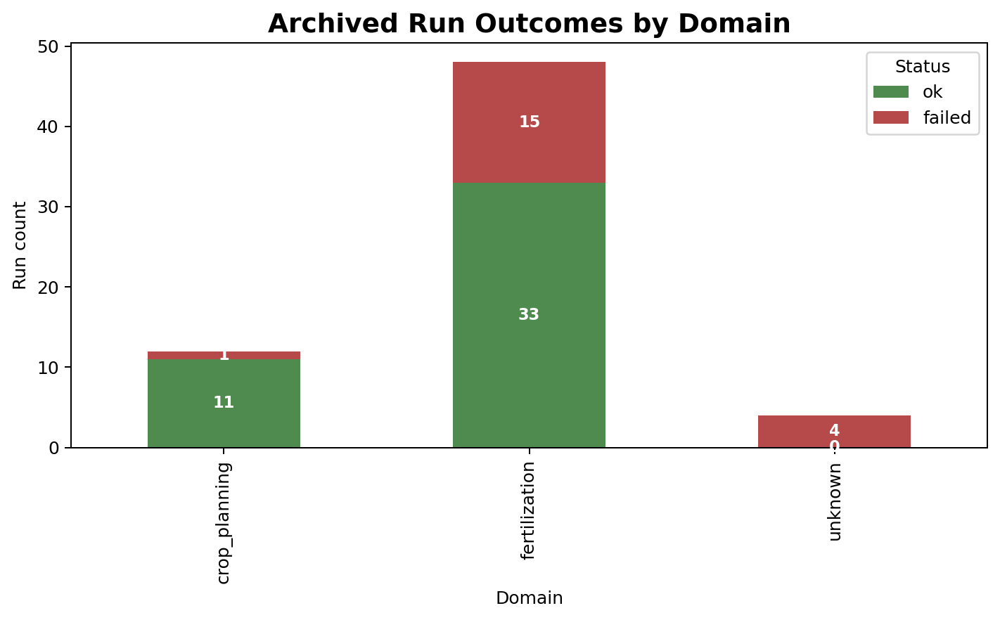
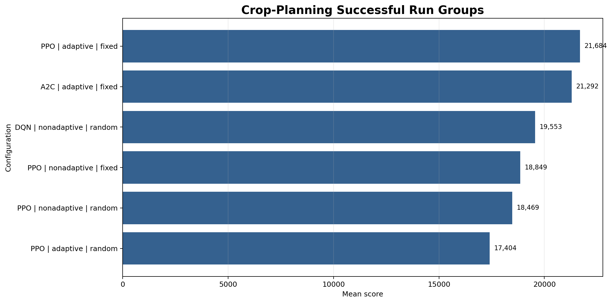
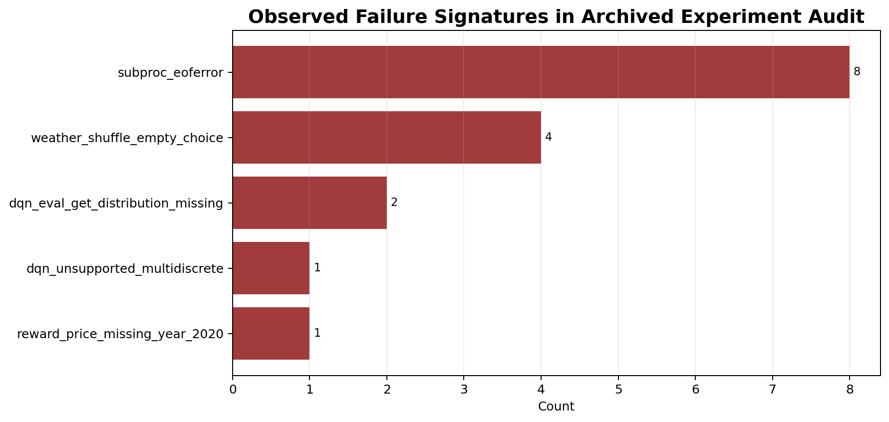

# Results Summary and Limitations

This page summarizes the archived experiment audit that was used to build the cleaned reporting narrative.
It is a documentation snapshot, not a replacement for the raw summary CSV and JSON outputs.

## Archived Audit Snapshot

| Metric | Value |
|---|---|
| aggregated archived runs reviewed | 64 |
| successful archived runs | 44 |
| failed archived runs | 20 |
| planned coverage rows in the archived coverage audit | 96 |
| successfully covered planned rows | 34 |
| most common archived failure signature | `subproc_eoferror` |

## Crop-Planning Snapshot

The archived grouped-success table shows the strongest crop-planning configuration in the reviewed snapshot as:

- domain: crop planning
- method: PPO
- policy mode: adaptive
- weather mode: fixed weather
- mean score: `21683.79`

## Fertilization Snapshot

The archived grouped-success summary indicates the strongest reviewed fertilization group in that snapshot as:

- domain: fertilization
- method: PPO
- policy mode: adaptive
- weather mode: random weather
- total years: `5000`
- mean score: `1186.0851`

These numbers should be treated as archived reporting evidence, not as a universal benchmark claim.

## Failure Pattern Snapshot

Failures are part of the story and should stay visible in final reporting.

Key archived failure labels:

- `subproc_eoferror`
- `weather_shuffle_empty_choice`
- `dqn_eval_get_distribution_missing`
- `reward_price_missing_year_2020`
- `dqn_unsupported_multidiscrete`

## How To Phrase Claims Responsibly

Use phrasing like:

- "within the archived experiment audit"
- "within the reviewed completed runs"
- "under the current Pakistan-focused simulator configuration"
- "under the current reward design and preprocessing pipeline"

Avoid phrasing like:

- "globally optimal"
- "field-validated recommendation"
- "general solution for agricultural planning"

## Current Limits

- the hierarchical controller remains experimental and should not be presented as the main deployment path
- the reporting snapshot is based on archived runs, not a freshly rerun public benchmark package
- the codebase still depends on local runtime artifacts for the full experiment story
- successful model promotion is still a manual operational step

## Recommended Next Step

If you want this section to become a permanent benchmark page, rerun the final public matrix from the cleaned repo layout and regenerate the figures from the new `runs/experiment_summaries/` outputs rather than from archived material.
