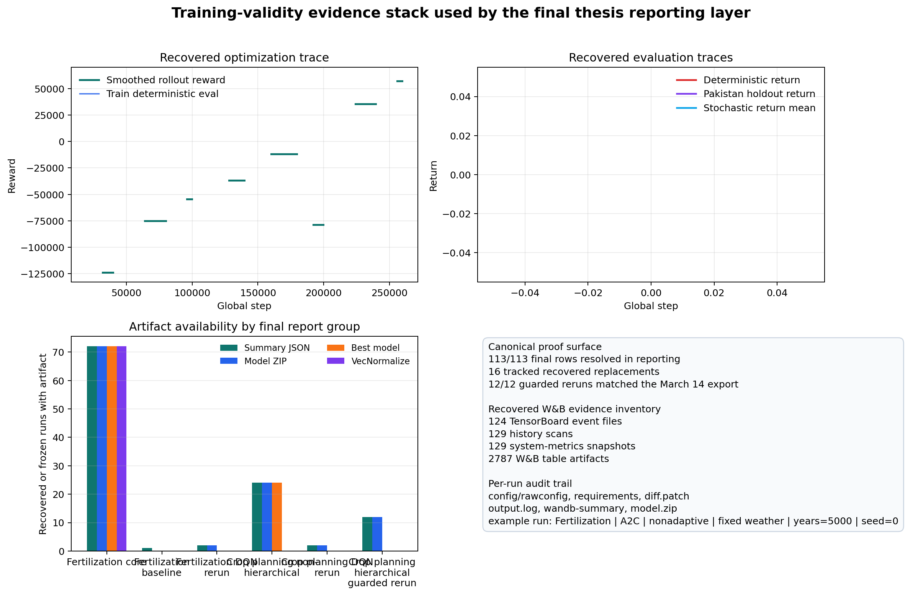

# Defense Q&A and Evidence Guide

This page is a committee-facing preparation sheet built from the canonical final reporting outputs in:

- `artifacts/final_successful_runs/final_113/`
- `artifacts/final_successful_runs/final_113/reporting/`

Use this page to answer four recurring defense questions:

1. what loopholes remain
2. how to answer attacks on training validity
3. which algorithm won in which setting
4. which graphs to show in the defense

## Evidence Surfaces

Use these files first during defense preparation:

- `artifacts/final_successful_runs/final_113/reporting/run_level_metrics.csv`
- `artifacts/final_successful_runs/final_113/reporting/grouped_metrics.csv`
- `artifacts/final_successful_runs/final_113/reporting/statistical_tests.csv`
- `artifacts/final_successful_runs/final_113/reporting/artifact_completeness_audit.csv`
- `artifacts/final_successful_runs/final_113/reporting/final_reporting_summary.json`

Use recovered raw evidence only as supporting provenance:

- `artifacts/final_successful_runs/Recovered/wandb_full_backup/**/history/history_scan.csv`
- `artifacts/final_successful_runs/Recovered/wandb_full_backup/**/run_files/wandb/run-*/files/*/events.out.tfevents*`
- `artifacts/final_successful_runs/Recovered/wandb_full_backup/**/system_metrics.json`
- `artifacts/final_successful_runs/Recovered/wandb_full_backup/**/run_files/output.log`
- `artifacts/final_successful_runs/Recovered/wandb_full_backup/**/run_files/model.zip`
- `artifacts/final_successful_runs/Recovered/wandb_full_backup/**/artifacts/logged/**/*.table.json`

The recovered backup inventory currently includes at least:

- 124 TensorBoard event files
- 129 `history_scan.csv` files
- 129 `system_metrics.json` files
- 2787 W&B table JSON artifacts

Those raw counts are larger than the canonical 113 reporting rows because the backup tree includes recovery and auxiliary W&B material in addition to the frozen final reporting set.

## What Requires Careful Framing

These are the areas a committee can still press on and therefore need disciplined framing.

### 1. Hierarchical RL remains the most sensitive branch

- The final hierarchical story is a corrected guarded rerun branch from 14 March 2026, not a simple continuation of the original raw March 7 to March 11 hierarchical regime.
- It should be reported in its own subsection because the reward and constraint regime was corrected with explicit guardrails.
- The best guarded repeated group is `PPO | fixed_weather | guarded_rerun` with mean deterministic return `1861223.08` and 95% CI `[1512430.79, 2210015.38]`.
- Even so, every guarded hierarchical group remains below the best baseline comparator on deterministic-return uplift.
- The artifact audit also shows that all 12 guarded hierarchical rerun rows are missing the old hierarchical thesis-report directories.

Safe defense line:

> The hierarchical branch is reported as a corrected guarded rerun study in its own subsection, not as the main winning deployment path.

### 2. Statistical strength is branch-dependent

- Inferential statistics are only justified for repeated three-seed groups.
- DQN reruns and the baseline row remain descriptive only.
- Fertilization shows clear factor-level signal.
- Crop planning non-hierarchical does not show strong factor-level separation at the current sample size.
- Guarded hierarchical reruns also remain statistically modest at the current sample size.

Safe defense line:

> I use inferential claims only where repeated three-seed groups exist. DQN and baseline rows are ablations, not equally strong inferential evidence.

### 3. Crop planning has a metric-interpretation trap

- The headline crop-planning metric is `eval_det_mean_reward`.
- Deterministic return is supporting evidence, not the headline ranking metric.
- PPO nonadaptive fixed-weather is the best repeated group on the headline metric.
- Adaptive fixed-weather variants look stronger on deterministic-return uplift versus the baseline comparator.

Safe defense line:

> Crop-planning winners depend on the metric. I rank by `eval_det_mean_reward` in the main table and use deterministic-return uplift only as supporting evidence.

### 4. Provenance is strong but not perfect

- The final frozen set contains 16 recovered replacements.
- Recovered rerun summary JSON files were reconstructed into the frozen bundle set from recovered metadata.
- The artifact audit still flags missing `vec_normalize` sidecars for part of the frozen set.

Safe defense line:

> The repo exposes provenance boundaries explicitly in the completeness audit instead of hiding them.

### 5. The thesis is still simulation-only

- The work is not field validated.
- Irrigation is not implemented as a learned action.
- The crop-planning stack remains centered on the working maize-soy configuration.

Safe defense line:

> The thesis demonstrates a simulation-based RL decision pipeline with auditable experimental evidence, not a field-validated farm deployment claim.

## How To Answer Attacks On Training Validity

Use the table below during the defense. Each answer is intentionally narrow and defensible.

| Committee attack | Safe answer | Evidence to show |
|---|---|---|
| How do you know the runs were really trained and not just summarized later? | Each final reported row can be traced back to preserved W&B metadata, history scans, output logs, and model artifacts in the recovered backup and frozen bundle set. | `run_level_metrics.csv`, `wandb_full_backup/**/history/history_scan.csv`, `run_files/output.log`, `run_files/model.zip` |
| How do you prove the hyperparameters and code state were preserved? | The recovered W&B folders retain `config.json`, `rawconfig.json`, metadata files, `requirements.txt`, and `diff.patch`, so the run configuration and environment are auditable. | `wandb_full_backup/**/config.json`, `rawconfig.json`, `run_files/requirements.txt`, `run_files/diff.patch` |
| How do you prove the training dynamics were sensible? | The recovered backup contains TensorBoard event files, W&B history scans, and system metrics. Those let me show learning curves, evaluation traces, and runtime behavior rather than just final scalar summaries. | `events.out.tfevents*`, `history_scan.csv`, `system_metrics.json` |
| How do you know recovered or interrupted runs did not corrupt the final story? | Recovered rows are explicitly tracked. The canonical final set records 16 replacements, and the reporting layer keeps the recovery provenance visible rather than mixing it silently with first-pass rows. | `final_reporting_summary.json`, `artifact_completeness_audit.csv`, `replacement_map.csv` |
| How do you know your conclusions are not based on one lucky seed? | For repeated groups I report means, standard deviations, 95% confidence intervals, ANOVA, and targeted pairwise tests. I avoid inferential claims for single-seed DQN and baseline rows. | `grouped_metrics.csv`, `statistical_tests.csv` |
| How do you know the hierarchical reruns are comparable to the rest? | I do not claim they are directly comparable in the main crop leaderboard. They are reported in a dedicated guarded-rerun subsection because the corrected reward and guardrail regime differs from the original raw setup. | `final_reporting_summary.json`, `grouped_metrics.csv` |

### Short Oral Answer

If the committee presses hard on whether training was done "correctly," use this answer:

> Correctness here means the training process was executed, logged, preserved, and audited in a reproducible way. I can show the configs, code-diff traces, training histories, TensorBoard event files, runtime logs, model artifacts, grouped statistics, and the completeness audit for the final frozen set.

### What Not To Claim

- Do not claim that every branch shows statistically significant pairwise winners.
- Do not claim that hierarchical RL won overall.
- Do not claim that DQN is equally well-supported as PPO or A2C.
- Do not claim field readiness or agronomic deployment validation.

## Which Algorithm Won In Which Setting

Interpret winners by branch, not globally across all experiments.

### Final Winner Table

| Branch | Headline metric | Best repeated group | Mean | 95% CI | Safe interpretation |
|---|---|---|---:|---|---|
| Fertilization | `deterministic_return` | `A2C \| nonadaptive \| fixed_weather \| years=5000` | `779267.35` | `[727686.53, 830848.18]` | Best repeated mean on the main fertilization objective |
| Fertilization robustness | `pak_holdout_return` | `A2C \| nonadaptive \| fixed_weather \| years=5000` | `731804.83` | use grouped table | Strongest repeated holdout robustness among top groups |
| Crop planning non-hierarchical | `eval_det_mean_reward` | `PPO \| nonadaptive \| fixed_weather` | `21230.91` | `[15225.61, 27236.22]` | Best repeated headline crop-planning result |
| Crop planning deterministic uplift note | `uplift_vs_best_baseline_det_mean` | `A2C \| adaptive \| fixed_weather` | `1498.70` | use grouped table | Best repeated positive deterministic-return uplift versus the baseline comparator |
| Hierarchical guarded reruns | `deterministic_return` | `PPO \| fixed_weather \| guarded_rerun` | `1861223.08` | `[1512430.79, 2210015.38]` | Best corrected guarded hierarchical mean, but still not the main winning branch |

### Important Boundary Examples

These examples help show that the analysis is balanced rather than cherry-picked.

| Branch | Boundary setting | Mean | Why it matters |
|---|---|---:|---|
| Fertilization | `A2C \| adaptive \| random_weather \| years=1000` | `-21923.25` | Shows A2C is not uniformly strong and low-budget random-weather settings can fail badly |
| Crop planning non-hierarchical | `A2C \| adaptive \| random_weather` | `18792.67` on `eval_det_mean_reward` | Shows crop differences are modest and not cleanly separated at current sample size |
| Hierarchical guarded reruns | all guarded groups | baseline uplift remains negative | Shows why the corrected hierarchical branch should stay in its own subsection rather than as the headline win |

### What The Statistics Actually Support

#### Fertilization

- `method` has the strongest factor effect: `p = 2.15e-20`, `eta^2 = 0.537`.
- `budget` is also strong: `p = 7.76e-11`, `eta^2 = 0.199`.
- `weather` is significant: `p = 0.00497`, `eta^2 = 0.024`.
- `adaptive` is significant but small: `p = 0.0298`, `eta^2 = 0.014`.
- `method x budget` is significant: `p = 8.47e-04`, `eta^2 = 0.046`.

Safe defense line:

> Fertilization is the branch where the experiment matrix produces the clearest factor-level signal.

#### Crop Planning Non-Hierarchical

- No ANOVA term is below `0.05` at the current sample size.
- The targeted pairwise comparisons all become non-significant after Holm correction.

Safe defense line:

> PPO nonadaptive fixed-weather is the best repeated mean on the headline metric, but I do not overclaim strong inferential separation among the crop-planning groups.

#### Hierarchical Guarded Reruns

- Neither `method` nor `weather` is significant at the current sample size.
- The targeted pairwise comparisons are also non-significant after correction.

Safe defense line:

> The guarded hierarchical reruns are useful as a corrected stress-test branch, but not as a statistically decisive winner.

## Which Graphs To Show In The Defense

Show a small number of graphs with a clear role. Avoid mixing all branches into one plot.

### Graph 1. Campaign Completion And Provenance

Plot:

- bar or stacked bar for `113` final rows
- highlight `16` recovered replacements
- highlight `12` corrected guarded hierarchical reruns
- highlight `4` DQN reruns

Use:

- `final_reporting_summary.json`

Why:

- this immediately answers "Was the campaign complete?"

### Graph 2. Fertilization Winners With 95% CIs

Plot:

- grouped bar or dot-and-whisker chart by fertilization repeated group
- y-axis: `deterministic_return`
- annotate the top group and use color for method

Use:

- `grouped_metrics.csv`
- `statistical_tests.csv`

Why:

- this is the strongest branch and should appear early

### Graph 3. Fertilization Robustness On Pakistan Holdout

Plot:

- bar or dot plot of `pak_holdout_return_mean`
- focus on top repeated fertilization groups only

Use:

- `grouped_metrics.csv`

Why:

- this shows the winning fertilization setting is not only good in-sample

### Graph 4. Non-Hierarchical Crop Planning Headline Results

Plot:

- dot-and-whisker chart for repeated crop groups
- y-axis: `eval_det_mean_reward`
- separate color by method and marker by weather regime

Use:

- `grouped_metrics.csv`
- `statistical_tests.csv`

Why:

- this shows the ranking clearly while still exposing the wide overlap in confidence intervals

### Graph 5. Crop Planning Deterministic-Uplift Companion Plot

Plot:

- small side plot or table for `uplift_vs_best_baseline_det_mean`
- show only crop non-hierarchical groups

Use:

- `grouped_metrics.csv`

Why:

- this prevents the committee from accusing you of hiding the metric nuance

### Graph 6. Hierarchical Guarded Reruns In Their Own Panel

Plot:

- separate panel only for guarded hierarchical groups
- y-axis: `deterministic_return`
- note that all groups remain below the best baseline comparator on uplift

Use:

- `grouped_metrics.csv`

Why:

- this is the cleanest way to disclose the hierarchical branch-specific positioning without confusing the main crop leaderboard

### Graph 7. Training Validity Slide

Plot:

- one slide with four small panels
- training reward curve from `history_scan.csv`
- evaluation curve or TensorBoard scalar from `events.out.tfevents*`
- runtime/resource panel from `system_metrics.json`
- artifact checklist panel from `artifact_completeness_audit.csv`

Use:

- recovered W&B backup
- canonical audit CSV

Why:

- this directly answers "How do you know training was done properly?"

## Presenter Rules

Keep these rules in mind during the viva:

- rank methods within a branch, not across incompatible branches
- keep hierarchical guarded reruns separate from the non-hierarchical crop leaderboard
- always name the metric before naming the winner
- use confidence intervals and ANOVA for repeated groups only
- call DQN and baseline rows descriptive ablations
- acknowledge provenance gaps before the committee has to point them out

## Contribution Framing

For the contribution delta versus the original CyclesGym snapshot, use [Contributions vs Original CyclesGym](09_contributions_vs_original_cyclesgym.md).

