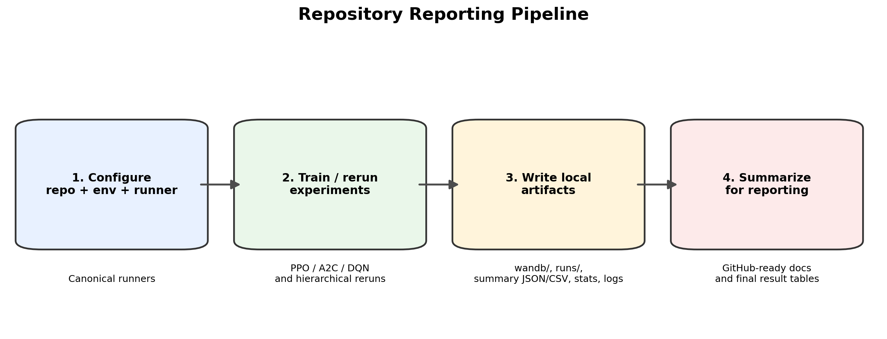

# Final Documentation

This is the push-ready documentation set for the cleaned repository.
It explains the project scope, setup, training workflow, reporting workflow, model management, and the current evidence snapshot without requiring the archived thesis folders.

## Start Here

1. [Overview and Scope](01_overview_and_scope.md)
2. [Setup and Usage](02_setup_and_usage.md)
3. [Architecture and Workflows](03_architecture_and_workflows.md)
4. [Reporting and Artifacts](04_reporting_and_artifacts.md)
5. [Model Management](05_model_management.md)
6. [Results Summary and Limitations](06_results_summary_and_limitations.md)
7. [Release Checklist](07_release_checklist.md)

## Audience

- engineers who need to run or extend the repo
- reviewers who need a concise description of the experiment and reporting flow
- future maintainers who need to know where outputs, models, and logs live

## Canonical Runtime Surface

- `cycles/`: simulator binaries and input data
- `cyclesgym/`: package code
- `experiments/`: train and evaluation entrypoints
- `scripts/build_pakistan_price_series.py`: retained utility
- `run_experiments_7_3_2026.py`: main experiment matrix runner
- `run_hierarchical_guarded_parallel.py`: hierarchical rerun runner
- `run_all_2.py`, `run_all_experiments.py`: compatibility wrappers

## Notes

- `docs/` is the public documentation surface intended for GitHub.
- `Local Files and Folders/` contains archived thesis notes, historical reports, demo files, and old local outputs. It is useful for provenance, but it is not required to understand the active repo layout.
