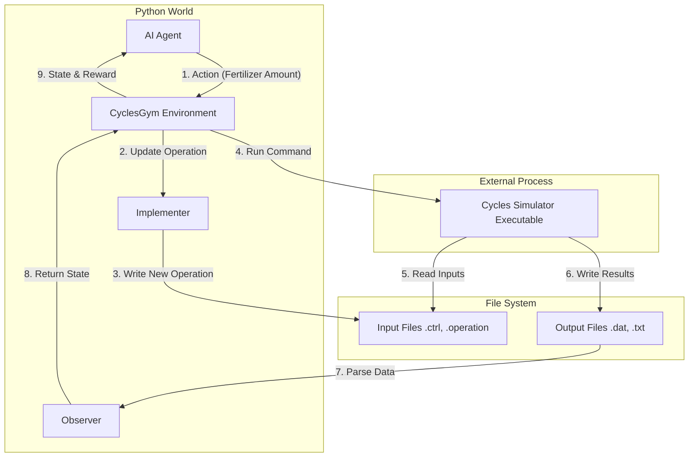
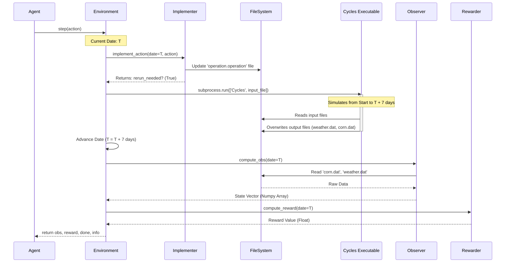

# 03. Architecture and Flows

This document explains **how the code actually works**. It covers the architecture of the system and the detailed timeline of a single simulation step.

## 🏗️ High-Level Architecture

The system is designed as a bridge between a standard Python AI agent and the external `Cycles` executable (which is written in C/Fortran and runs as a separate process).

### The Big Picture Diagram

### Components Breakdown

1.  **CyclesGym Environment (`CyclesEnv`)**: The main controller. It inherits from `gym.Env`. It manages the timeline and orchestrates the other components.
2.  **Implementer**: This class is responsible for **translating actions into file edits**.
    *   *Example*: If the action is `10` (kg/ha of N), the Implementer opens the `operation.operation` file, finds the current date, and adds a `FERTILIZATION` event with `MASS 10`.
3.  **Cycles Simulator**: The black box. It takes file inputs and produces file outputs. We treat it as a function: $Files_{in} \to Files_{out}$.
4.  **Observer**: This class is responsible for **reading output files and creating the state vector**.
    *   *Example*: It reads `Corn.dat`, extracts `Biomass` and `GrainYield`, reads `weather.weather` for today's temperature, and combines them into a numpy array.

## 🌊 The "Step" Flow

Detailed sequence of what happens when you call `env.step(action)`.

### Sequence Diagram

### Key Takeaway: "The Restart Hack"

You might notice something inefficient. **Cycles** is not an interactive program. You cannot "pause" it, inject a command, and "resume" it. It runs from Start to Finish.

So, how do we make IT interactive? **We restart it constantly.**

*   **Step 1 (Day 1)**: Write operations for Day 1. Run Cycles from Day 1 -> Day 8. Read outputs.
*   **Step 2 (Day 8)**: Write operations for Day 8. Run Cycles from Day 1 -> Day 15. (Yes, it re-simulates Day 1-8!). Read outputs.

*Note: The code has optimizations to avoid re-simulating unchanged parts using "Reinitialization" files, but the mental model of "Add operation -> Re-run" is the safest way to understand it.*

---
**Next Step**: Go to `04_Code_Walkthrough.md` for a deep dive into the classes and files.
