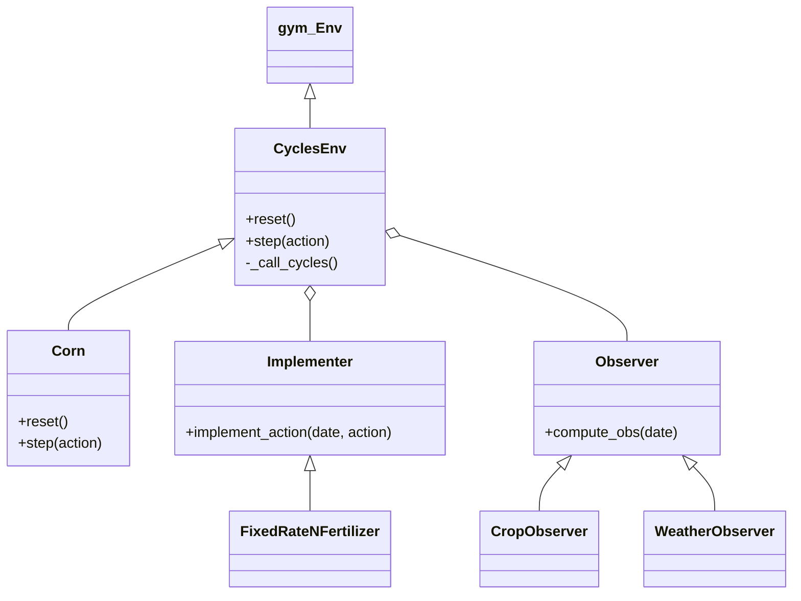

# 04. Code Walkthrough

Now that you understand the "Flow", let's look at the actual Python classes. The code is modular, separating the *Environment* logic from the *Simulation* logic.

## 📂 Directory Structure

*   `cyclesgym/`
    *   `envs/`
        *   `common.py`: The base class `CyclesEnv`.
        *   `corn.py`: The specific Corn environment `Corn`.
        *   `implementers.py`: Code that writes to `operation.operation`.
        *   `observers.py`: Code that reads from `corn.dat`.
    *   `managers/`: Helper classes to parse specific file formats (`.weather`, `.ctrl`, etc.).

## 🧩 Key Classes

### 1. `CyclesEnv` (in `common.py`)
This is the parent class for all environments.
*   **Role**: Manages the directory setup (`input/`, `output/`) and the Simulation Loop.
*   **Key Methods**:
    *   `_common_reset()`: Copies input files to a temporary folder so we don't not mess up the original data.
    *   `_call_cycles()`: Executes the terminal command to run the simulation.

### 2. `Corn` (in `corn.py`)
This inherits from `CyclesEnv`.
*   **Role**: Specifies we are growing Corn in Pennsylvania (or elsewhere).
*   **Key Setup**:
    *   Defines the **Action Space** (How much Nitrogen? e.g., Discrete 10 levels).
    *   Defines the **Observation Space** (What do we see? e.g., Weather + Plant Size).
    *   Initializes the specific `Implementer` and `Observer`.

### 3. `Implementer` (in `implementers.py`)
The "Writer".
*   **`FixedRateNFertilizer`**:
    *   Takes an action (Float or Int).
    *   Calculates amount of NH4 and NO3.
    *   **Writes** a line to the `operation` file: `1  100  FERTILIZATION  MASS  50 ...`

### 4. `Observer` (in `observers.py`)
The "Reader".
*   **`WeatherObserver`**: Reads `weather.dat` to get Min/Max Temp, Rain.
*   **`CropObserver`**: Reads `corn.dat` to get Biomass, Yield, Stage.
*   **`compound_observer`**: Combines multiple observers. (e.g. Weather + Crop).

## 📊 Class Diagram

---
**Next Step**: Go to `05_Real_Life_Example.md` to see why this actually matters.
