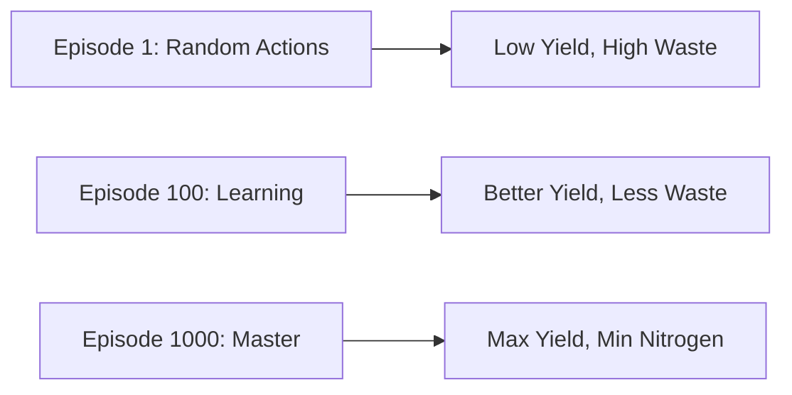

# 05. Real Life Example: The "Nitrogen Dilemma"

To help you understand *why* we are doing this, let's look at a concrete real-world scenario.

## 🌽 The Goal: Grow Corn in State College, PA

**Location**: State College, Pennsylvania (Home of Penn State).
**Soil**: `Hagerstown_Silt_Loam` (A common soil type there).
**Objective**: Maximize Profit.

## 💰 The Economics

$$ Profit = (Yield \times Price_{corn}) - (Nitrogen \times Cost_{nitrogen}) $$

*   **Corn Price**: ~$0.16 per kg.
*   **Nitrogen Cost**: ~$1.00 per kg.

### The Catch (The Trade-off)
*   **Case A (Starvation)**: You apply **0 kg** of Nitrogen.
    *   *Result*: The plant is small and yellow. Yield is low.
    *   *Profit*: Low.
*   **Case B (Excess)**: You apply **300 kg** of Nitrogen.
    *   *Result*: The plant is huge and green. Yield is maxed out.
    *   *Problem*: The plant can only eat ~150 kg. The other 150 kg washes away into the river (Leaching).
    *   *Profit*: Not optimal, because you wasted money on fertilizer the plant didn't use.

## 🤖 The AI's Job

The AI agent needs to find the **"Sweet Spot"**.
But it's harder than just picking a number like "150 kg". It depends on **TIMING**.

### Scenario: The Rainy Year
*   **Date**: May 15th.
*   **State**: The weather forecast says huge rain storm coming.
*   **Decision**:
    *   *Bad Agent*: Applies 50kg N today. -> Rain washes it all away tomorrow. Money wasted. 💸
    *   *Good Agent*: Waits 3 days until rain passes. Applies 50kg N. -> Plant eats it. Profit! 📈

### Scenario: The Dry Year
*   **State**: No rain for 2 weeks.
*   **Decision**:
    *   *Bad Agent*: Applies fertilizer on dry surface. It just sits there, unable to move to roots.
    *   *Good Agent*: Applies smaller amounts frequently or waits for moisture.

## 📊 Visualizing Success

When you train your agent, you should see a curve like this:

### What does a solved policy look like?
An optimal policy for Corn in PA usually looks like a **"Side-dress"** strategy:
1.  **Planting (May)**: Small amount of N (starter).
2.  **Growth Spurt (June)**: Large amount of N just before the plant grows fast.
3.  **Late Season (August)**: Zero N (corn is done growing).

Your RL agent should essentially "rediscover" this agronomic principle purely by trial and error!
