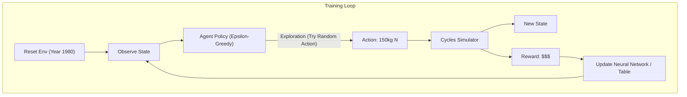
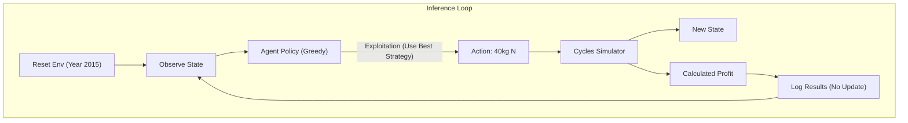

# 06. Training vs. Inference Cycles & Economics

Understanding how the system behaves during **Training** (Learning) versus **Inference** (Deployment) is critical for engineers. This document breaks down the flows and explains the **Economic Model** that drives the AI's decisions.

## 🔄 The Two Cycles

### 1. Training Cycle (The "Student" Phase)
**Goal**: Learn the optimal policy ($\pi^*$) by trial and error.
**Key Characteristic**: High Exploration. The agent intentionally makes "bad" decisions (like applying too much or too little fertilizer) to see what happens.



### 2. Inference Cycle (The "Professional" Phase)
**Goal**: Maximize profit using the learned policy.
**Key Characteristic**: No Exploration (Greedy). The agent always chooses the action it believes is best. Weights are frozen.


---

## 💰 The Economic Model (The "Why")

The agent doesn't care about "big plants". It cares about **Money**.
The Reward Function defines the economics of the farm.

### The Equation
$$ Reward_t = Profit_{Harvest} - Cost_{Fertilizer} $$

Where:
1.  **Harvest Profit**: Occurs ONLY at harvest time (once per season).
    $$ Profit = Yield (tonnes/ha) \times Price_{Crop} (\$/tonne) $$
2.  **Fertilizer Cost**: Occurs EVERY time you apply fertilizer.
    $$ Cost = Amount (kg/ha) \times Price_{Nitrogen} (\$/kg) $$

### 📉 Dynamic Prices (Real World Complexity)
In this repo, prices are **NOT constant**. They change every year based on historical data.

*   **Year 1980**:
    *   Corn Price: Low 📉
    *   Nitrogen Price: Low 📉
    *   *Strategy*: Fertilizer is cheap, so maybe use a lot?
*   **Year 2012**:
    *   Corn Price: High 📈
    *   Nitrogen Price: High 📈
    *   *Strategy*: Fertilizer is expensive, but Corn is worth a lot. You must be very precise. Wasting N is expensive, but losing Yield is even worse.

### Code Reference (`rewarders.py`)
```python
# Harvest Reward
harvest_dollars_per_hectare = harvest * dollars_per_tonne[year]

# Nitrogen Cost
N_dollars_per_hectare = Nkg_per_heactare * N_price_dollars_per_kg[year]

# Total Reward
return harvest_dollars_per_hectare - N_dollars_per_hectare
```

## 🧠 What the Engineer Needs to Know

| Feature | Training Flow | Inference Flow |
| :--- | :--- | :--- |
| **Weights** | Updating constantly (Backprop) | Frozen (Read-only) |
| **Action Selection** | Stochastic (Randomness added) | Deterministic (Argmax) |
| **Years** | usually 1980-2000 (Training Set) | usually 2000-2015 (Test Set) |
| **Metric** | "Average Reward" (Convergence) | "Net Profit ($/ha)" (Business Value) |

### Why separate them?
If you run inference on the training years (1980-2000), your results are biased (the agent "memorized" the weather).
**ALWAYS** test your agent on "Held-out" years (e.g., 2000-2015) to see if it actually learned the *dynamics* of agriculture or just memorized that "1988 was a drought".
