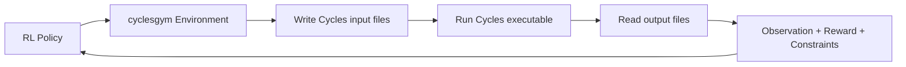

# 00. Zero-to-100 Overview

## Repository Mission

This repository wraps the CYCLES crop simulator in a Gym/Gymnasium-style RL interface so an agent can learn farm-management decisions from simulation.

The active thesis framing in this repo is:
- optimize resource allocation under uncertainty
- treat decisions as cost-sensitive, not only yield-maximizing
- focus on Pakistan weather/soil setup currently wired in code

## What Is Optimized Today

1. Nitrogen fertilization amount (weekly decisions, kg/ha)
2. Crop choice in a rotation (yearly decisions, categorical action)

## What Is Not Optimized Today

1. Irrigation scheduling as a learned control variable
2. Multi-field land allocation
3. Rich market/risk models (dynamic prices, insurance, supply chain effects)

## 0-to-100 Learning Plan

1. Level 0-20: read `01_Setup_and_First_Run.md` and run one environment.
2. Level 20-40: read `02_Agriculture_and_RL_Fundamentals.md`.
3. Level 40-60: read `03_Architecture_and_Code_Map.md`.
4. Level 60-80: read `04_Environment_Flows.md` and `05_Training_Algorithms_and_Experimentation.md`.
5. Level 80-100: read `06_Inference_Demo_and_Usage.md`, `07_Thesis_Defense_Pack.md`, and `08_Gaps_and_Future_Work.md`.

## Mental Model In One Diagram

## Practical Repo Map

- `cyclesgym/envs/`: environment logic (step/reset, observer/rewarder/implementer wiring)
- `cyclesgym/managers/`: file parsers/writers for control, operation, weather, crop, soil N, season
- `experiments/fertilization/`: fertilization training/evaluation
- `experiments/crop_planning/`: crop-planning training/evaluation
- `demo/`: inference-first Streamlit and CLI demo
- `cycles/input` and `cycles/output`: simulator inputs and run outputs

## Current Thesis Reality Check

From existing audit docs and artifacts:
- experiment matrix plan exists and is broad
- full matrix is not yet fully executed to completion
- strongest current claims are "best observed under available runs", not global optimum over full design space
