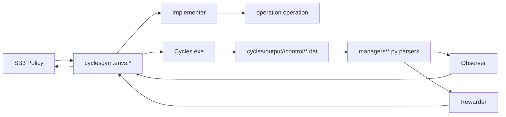
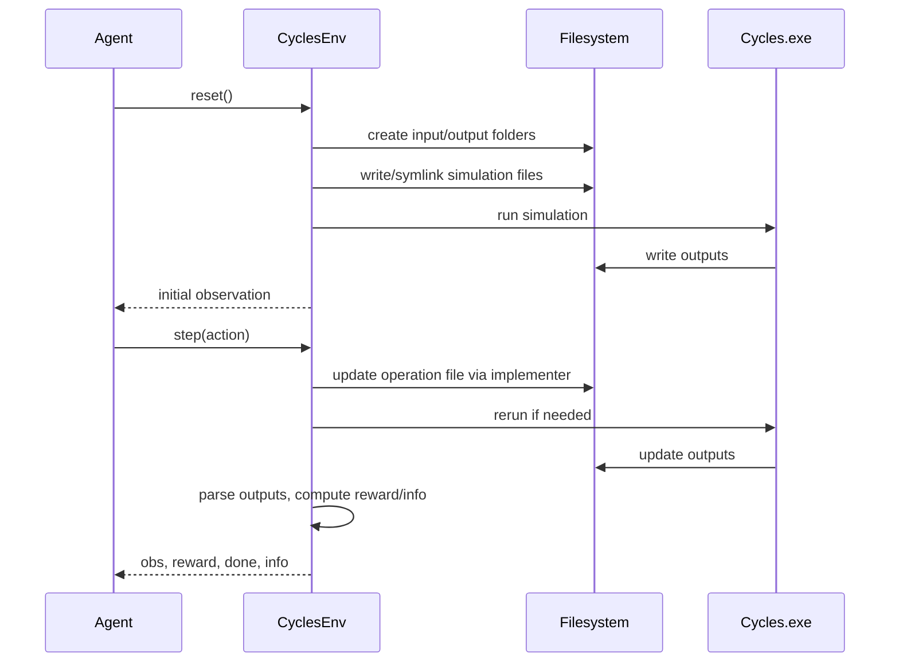

# 03. Architecture and Code Map

## End-to-End Architecture

## Core Modules and Responsibilities

### Environment Base
- `cyclesgym/envs/common.py` (`CyclesEnv`)
  - creates per-run input/output dirs
  - builds control/operation/soil/crop/weather files for each run
  - invokes CYCLES executable
  - updates output managers after execution

### Fertilization Environment
- `cyclesgym/envs/corn.py` (`Corn`)
  - discrete action to N-mass mapping
  - observer = weather + crop + cumulative N
  - reward = crop revenue + N cost
  - constraints = N total, event count, leaching/emission info

### Crop Planning Environment
- `cyclesgym/envs/crop_planning.py`
  - action includes crop choice and planting-window parameters (variant-dependent)
  - observer focuses on soil N or rotation-window representation
  - reward from crop-profit terms

### File Managers
- `cyclesgym/managers/control.py`: parse/write control files
- `cyclesgym/managers/operation.py`: parse/write operation schedules
- `cyclesgym/managers/weather.py`: weather IO and day-level lookup
- `cyclesgym/managers/crop.py`, `soil_n.py`, `season.py`: output parsing

### Weather Generation
- `cyclesgym/envs/weather_generator.py`
  - `FixedWeatherGenerator`: reuse one weather stream
  - `WeatherShuffler`: generate shuffled-year weather scenarios

## Simulation Lifecycle

## Repo Entry Points

1. Env registration and IDs: `cyclesgym/__init__.py`
2. Fertilization training: `experiments/fertilization/train.py`
3. Crop-planning training: `experiments/crop_planning/train.py`
4. Experiment matrix runners: `run_all_experiments.py`, `run_all_2.py`, `master_runner_run_all.2.py`
5. Inference demo: `demo/app.py`, `demo/run_demo_cli.py`, `demo/inference_engine.py`

## Data and Geography Assumptions in Current Code

Current defaults in active training/demo flows use Pakistan files:
- weather: `cycles/input/Pakistan_Site_final.weather`
- soil: `cycles/input/Pakistan_Soil_final.soil`

Year bounds are clamped around the available weather range in fertilization training scripts.
