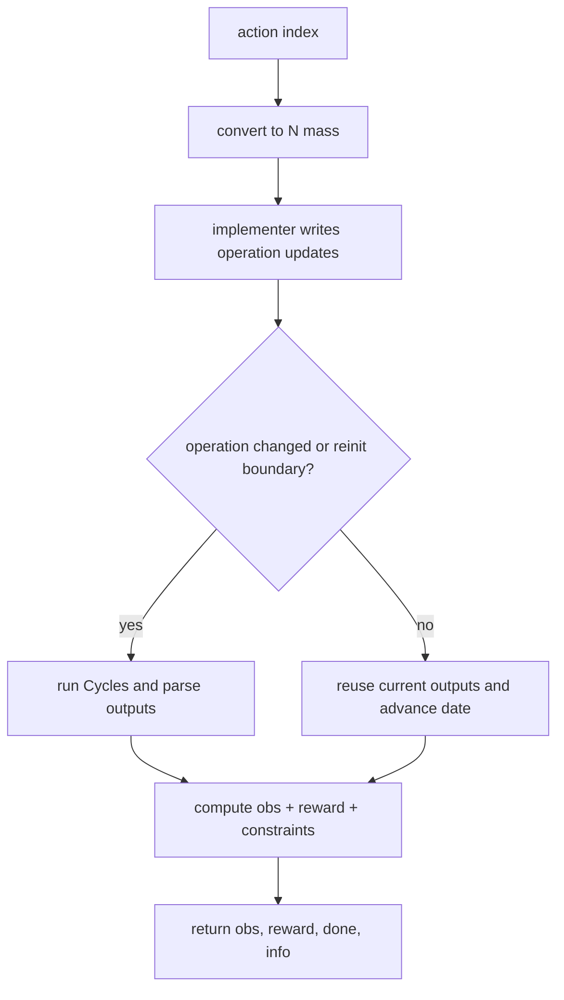
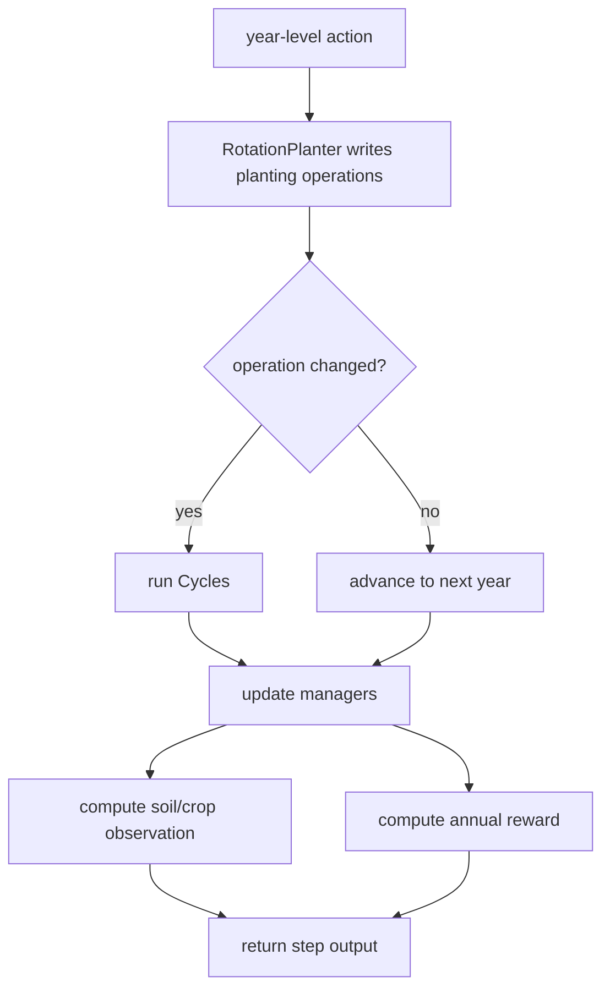

# 04. Environment Flows

## Fertilization Environment (`Corn`)

Primary implementation: `cyclesgym/envs/corn.py`

### Action Design

Action space is discrete:

```text
action_index in {0, ..., n_actions-1}
N_mass_kg_per_ha = maxN * action_index / (n_actions - 1)
```

This keeps policy outputs simple while still representing a continuous agronomic control range.

### Observation Design

Combined observer stack:
1. `WeatherObserver`
2. `CropObserver`
3. `NToDateObserver`

In some experiment variants (`experiments/fertilization/corn_soil_refined.py`), soil-N features are added and then masked for adaptive vs non-adaptive experiments.

### Reward Design

Compound reward in fertilization env:
1. crop revenue term (`CropRewarder`)
2. nitrogen cost term (`NProfitabilityRewarder`, negative)

### Constraints and Info

Computed constraint signals include:
1. total nitrogen applied
2. fertilization event count
3. leaching/volatilization/emission indicators

These are returned via `info` and can support constrained-RL style evaluation even when training is unconstrained.

### Step Workflow



## Crop-Planning Environment

Primary implementation: `cyclesgym/envs/crop_planning.py`

### Action Design

Variants:
1. `CropPlanning`: crop + planting window parameters
2. `CropPlanningFixedPlanting`: simplified crop + planting day choice
3. `CropPlanningFixedPlantingRotationObserver`: non-adaptive representation

### Observation Design

Depending on variant:
1. soil-N based observer
2. trailing crop-rotation window observer

### Reward Design

Reward is crop-profit oriented across yearly decisions, using crop reward components.

### Workflow



## Weather Mode Effect on Both Environments

1. Fixed weather:
   - lower variance, easier optimization
   - weaker generalization signal
2. Shuffled weather:
   - higher variance and training difficulty
   - stronger robustness signal for unseen conditions

## Practical Extension Points

1. New observations: implement new observer or compose with `compound_observer`.
2. New actions: add implementer class and wire it in env init.
3. New economics: add rewarder and compose with `compound_rewarder`.
4. New constraints: add constrainer and include in compound constrainer.
