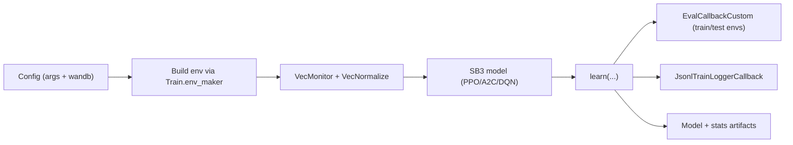

# 05. Training Algorithms and Experimentation

## Training Pipeline in This Repo

Main scripts:
- `experiments/fertilization/train.py`
- `experiments/crop_planning/train.py`

## Algorithm Behavior in Practical Terms

### PPO
- on-policy actor-critic with clipped policy updates
- default strongest option in current observed runs
- stable for discrete and wrapped action spaces used here

### A2C
- on-policy actor-critic, simpler than PPO
- lower implementation complexity, often less stable/performant in this setup

### DQN
- value-based Q-learning for discrete actions
- fertilization can use it directly
- crop planning needs MultiDiscrete-to-Discrete wrapper (`MultiDiscreteToDiscreteActionWrapper`)

## Evaluation Design

1. periodic evaluation callbacks on train-like and holdout-like settings
2. deterministic and stochastic evaluation branches
3. holdout-style metrics logged for fertilization (`pak_holdout_return`)
4. VecNormalize stats saved and reused for inference consistency

## Experiment Matrix Runners

1. `run_all_experiments.py`  
   mixed command list for baseline and algorithm variants
2. `master_runner_run_all.2.py`  
   runs fertilization variants not covered by run_all_experiments defaults
3. `run_all_2.py`  
   thesis-focused matrix builder with CSV summary output

## Evidence Snapshot from Existing Audit Docs

From `Experimentation and Results` markdown:
- planned `run_all_2` matrix: 96 configurations
- observed successful coverage in audit window: 34 configurations
- audited run folders: 64 (44 ok, 16 failed traceback, 4 no-summary)

This supports directional conclusions, not full-matrix optimum claims.

## Known Failure Signatures (Observed)

1. `subproc_eoferror` in vectorized subprocess rollouts
2. weather shuffle empty-choice errors due invalid sampling windows
3. DQN distribution-path compatibility issues in evaluation
4. MultiDiscrete DQN incompatibility without wrapper
5. year-key gaps in pricing for out-of-range years (partly mitigated by fallback lookup)

## Reproducibility Checklist

1. pin Python, NumPy, SB3 versions (see `environment.yml`)
2. save and reuse `VecNormalize` stats for inference
3. keep weather year bounds consistent between training and evaluation
4. run at least 3 seeds per major config before making strong claims
5. export summary CSV after matrix execution (`run_all_2.py --summary-csv ...`)
