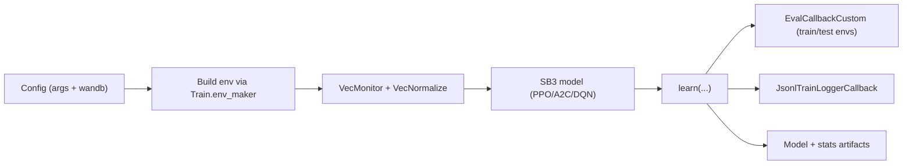

# 05. Training Algorithms and Experimentation

## Training Pipeline in This Repo

```mermaid
flowchart LR
    A["Config (args + wandb)"] --> B["Build env via Train.env_maker"]
    B --> C["VecMonitor + VecNormalize"]
    C --> D["SB3 model (PPO/A2C/DQN)"]
    D --> E["learn(...)"]
    E --> F["EvalCallbackCustom (train/test envs)"]
    E --> G["JsonlTrainLoggerCallback"]
    E --> H["Model + stats artifacts"]
```

Main scripts:
- `experiments/fertilization/train.py`
- `experiments/crop_planning/train.py`

## Algorithm Behavior in Practical Terms

### PPO
- on-policy actor-critic with clipped policy updates
- strongest overall fertilization option across the completed matrix
- also competitive in non-hierarchical crop planning

### A2C
- on-policy actor-critic, simpler than PPO
- competitive in crop planning and one major fertilization pocket
- less consistently strong than PPO across the full matrix

### DQN
- value-based Q-learning for discrete actions
- used here as an ablation, not the main thesis recommendation
- crop planning needs `MultiDiscreteToDiscreteActionWrapper`

## Evaluation Design

1. periodic evaluation callbacks on train-like and holdout-like settings
2. deterministic and stochastic evaluation branches
3. holdout-style metrics logged for fertilization (`pak_holdout_return`)
4. VecNormalize stats saved and reused for inference consistency

## Experiment Matrix Runners

1. `run_experiments_7_3_2026.py`
   defines the 113-case thesis matrix
2. `10_3_2026_experiments.py`
   executes the non-hierarchical tail of that matrix and the DQN reruns
3. `10_3_2026_heira_exp.py`
   executes the hierarchical branch in parallel
4. legacy runners (`run_all_experiments.py`, `master_runner_run_all.2.py`, `run_all_2.py`)
   remain useful as earlier experiment-history references

## Completed Matrix Snapshot

From the March 11, 2026 export:
- planned matrix: `113`
- unique finished configs: `113/113`
- total attempts: `117`
- rerun-sensitive jobs: `4` DQN ablations
- finished by domain: `75` fertilization, `26` crop planning, `12` hierarchical failed-ablation runs

Result summary:
- fertilization: PPO is strongest overall, but `A2C + nonadaptive + fixed_weather + 5000` is the top repeated group
- crop planning: PPO and A2C are both competitive; `PPO + nonadaptive + fixed_weather` is the best repeated group
- hierarchical: all runs finished, but the branch failed as an ablation and is excluded from the main comparison tables
- hierarchical failure evidence: mean nutrient cost is about `8.6M`, only `38.3%` of yearly decisions had defined calendar windows, and the cost-vs-return correlation is `-0.85`

## Failure and Recovery Snapshot

1. all four failed attempts were DQN ablations and were rerun successfully
2. crop-planning DQN still depends on the MultiDiscrete wrapper path
3. hierarchical runs are computationally expensive and failed as an ablation because fertilizer cost overwhelms sparse crop reward while calendar coverage is incomplete
4. post-processing still needs confidence intervals and effect-size reporting

## Reproducibility Checklist

1. pin Python, NumPy, and SB3 versions (see `environment.yml`)
2. save and reuse `VecNormalize` stats for inference
3. keep weather year bounds consistent between training and evaluation
4. aggregate results over the available three-seed groups before claiming superiority
5. export the final W&B CSV and keep it alongside generated summary tables
