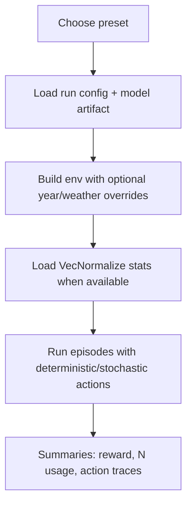

# 06. Inference Demo and Usage

## Purpose

The `demo/` module is inference-first: it lets you present model behavior without retraining.

Core files:
- `demo/app.py` (Streamlit UI)
- `demo/run_demo_cli.py` (CLI entrypoint)
- `demo/inference_engine.py` (shared runtime logic)
- `demo/model_presets.json` (curated presets)

## Runtime Flow



## Streamlit Demo Workflow

1. Open `Live Inference (Fertilization)` page.
2. Select preset (`fert_robust_random`, `fert_peak_fixed`, etc.).
3. Set episodes, deterministic/stochastic mode, optional weather/year override.
4. Run inference and review:
   - mean total reward
   - mean total N (kg/ha)
   - per-episode summary
   - first-episode action/reward traces

## CLI Workflow

Example:

```bash
python demo/run_demo_cli.py --preset fert_robust_random --episodes 3 --deterministic --weather-mode default
```

Useful flags:
- `--start-year`, `--end-year`
- `--weather-mode default|fixed|random`
- `--output demo/output/latest_inference.json`

## Why the Demo Is Thesis-Relevant

1. It translates trained policy artifacts into an explainable user flow.
2. It demonstrates cost-driven recommendations in Pakistan-configured simulations.
3. It supports defense storytelling from model output to practical farmer/advisor usage.

## Deployment Direction (Short Horizon)

Near-term path (already proposed in existing docs):
1. inference API (FastAPI/Flask)
2. lightweight web UI
3. guardrails for out-of-distribution inputs and resource constraints

This can be positioned as decision support, not autonomous farm control.
