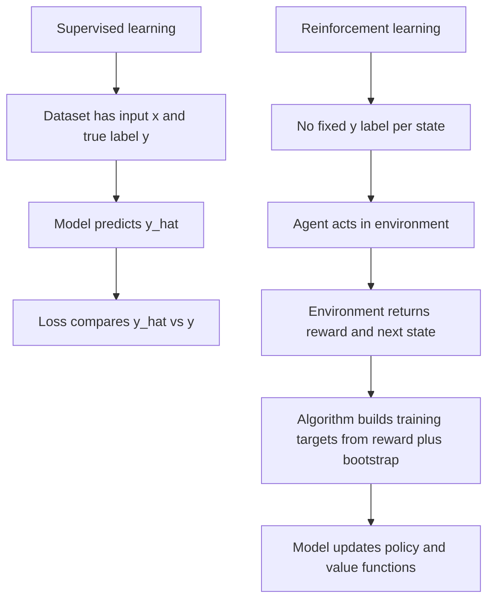
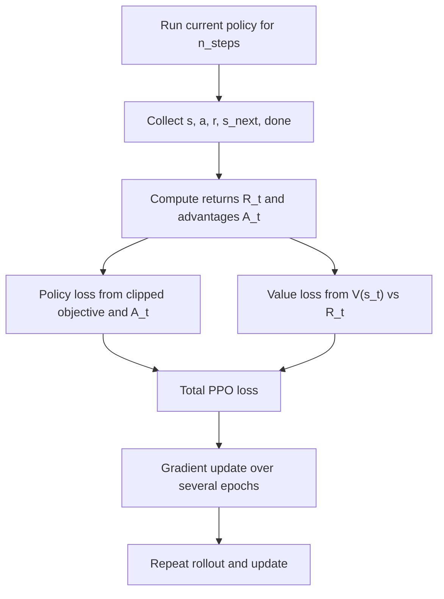
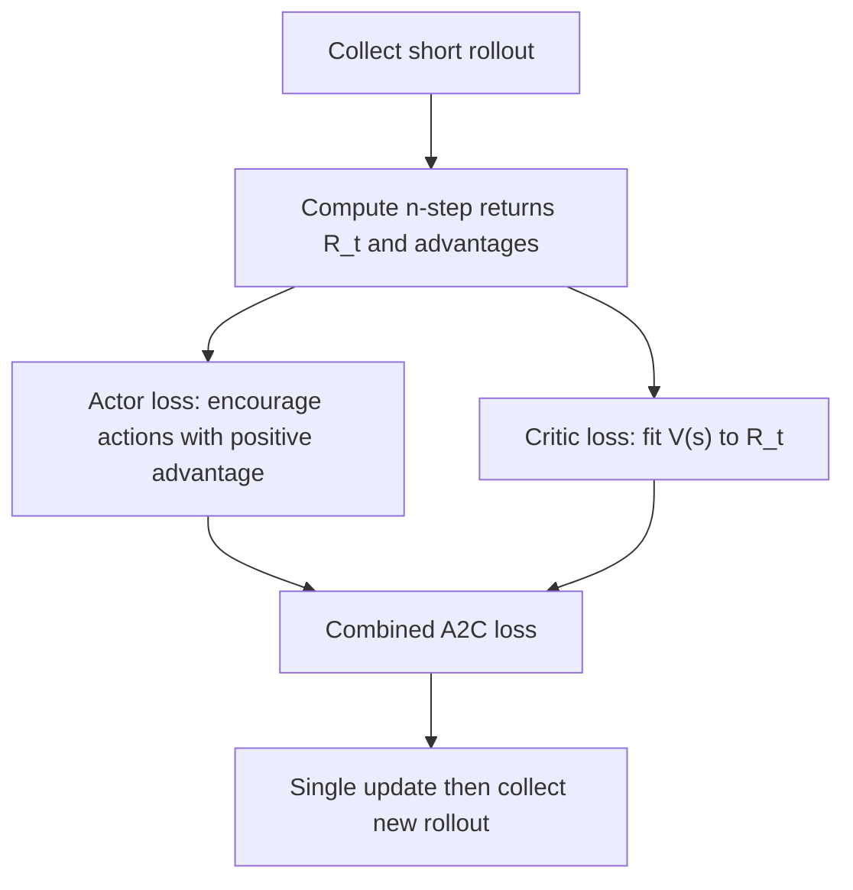
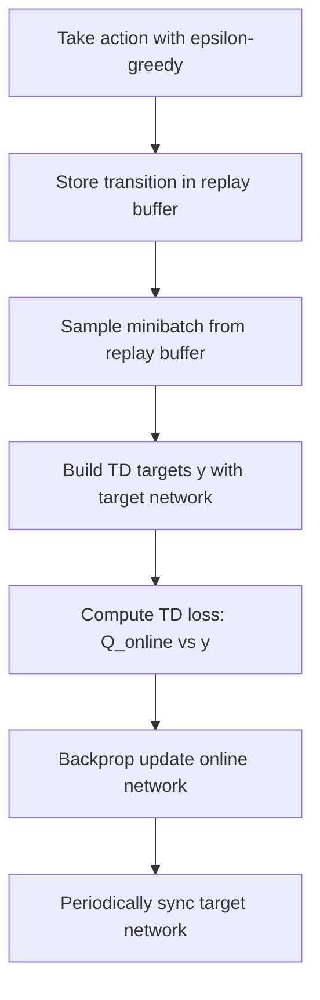
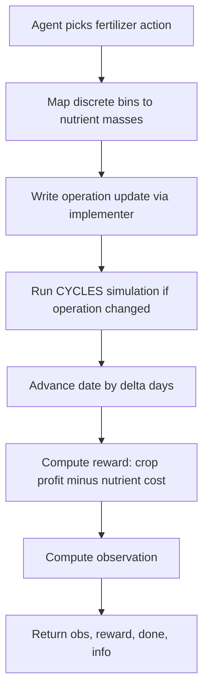
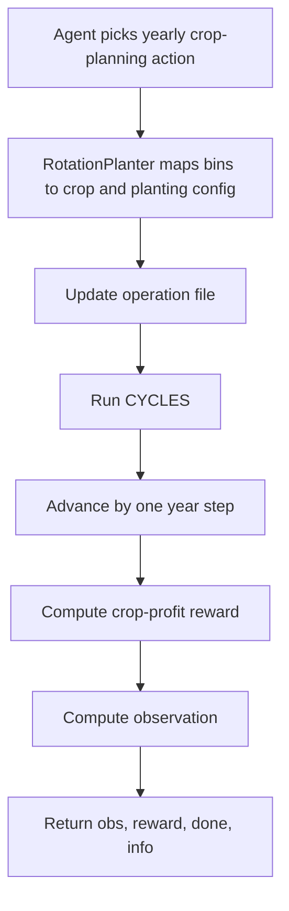
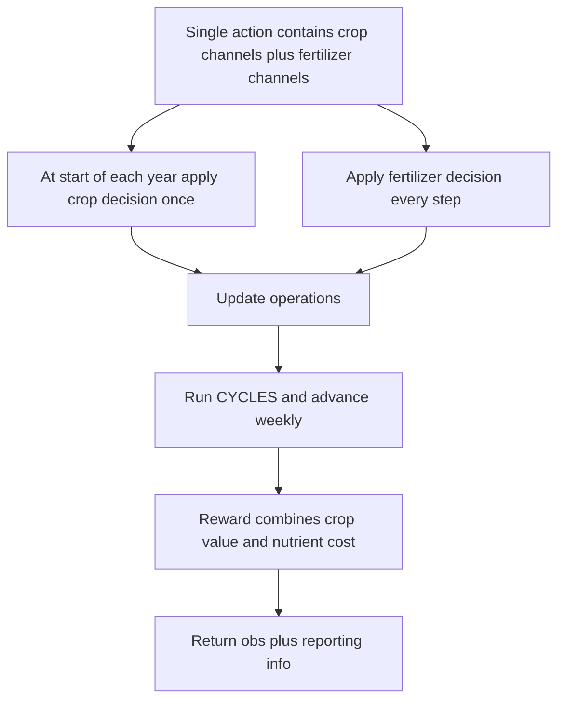

# 10. RL Training Targets and Workflows (Noob-Friendly)

## 1) Direct Answer to Your Question
You are asking the right question.

In this project, RL does not train against fixed "true labels" like supervised learning.
Instead, the agent learns from:
1. rewards produced by the environment,
2. bootstrapped targets built from those rewards, and
3. its own value estimates.

So yes: RL works differently from normal label-based loss minimization.

## 2) Supervised Learning vs RL (What Changes)

Core RL objective:
- maximize expected cumulative reward over time.

Equivalent optimization view:
- implementations minimize losses that are mathematically linked to maximizing long-term reward.

## 3) Where Rewards Come From in This Repo

### Fertilization (`Corn`, `CornSoilRefined`, `NonAdaptiveCorn`)
Reward is compound:
1. crop revenue term,
2. nutrient cost penalty term.

Practical form:
- `reward = crop_profit - fertilizer_cost`

Code path:
- `cyclesgym/envs/corn.py`
- `cyclesgym/envs/rewarders.py` (`CropRewarder`, `NProfitabilityRewarder`, `NPKProfitabilityRewarder`, `compound_rewarder`)

### Crop Planning (`CropPlanning*`)
Reward is crop-profit oriented from harvest output.

Practical form:
- `reward = sum(crop profits from rotation choices)`

Code path:
- `cyclesgym/envs/crop_planning.py`
- `cyclesgym/envs/rewarders.py`

### Hierarchical Crop Planning + Fertilization
Reward combines:
1. crop rewards,
2. fertilizer cost penalty.

Practical form:
- `reward = crop_profit - nutrient_cost`

Code path:
- `cyclesgym/envs/hierarchical.py`
- `cyclesgym/envs/rewarders.py`

## 4) End-to-End Training Pipeline in This Repo

Main scripts:
- `experiments/fertilization/train.py`
- `experiments/crop_planning/train.py`

## 5) What Is the "Target" for Each Algorithm?

### PPO (On-policy actor-critic)
Used in:
- fertilization,
- crop planning,
- hierarchical crop planning.

PPO learns two things:
1. Policy `pi(a|s)`
2. Value function `V(s)`

Training targets:
1. **Value target**: return estimate `R_t` (from rewards plus bootstrap).  
   Value loss compares `V(s_t)` vs `R_t`.
2. **Policy target**: no class label. Policy update uses advantage `A_t`.
   If `A_t > 0`, increase probability of that action; if `A_t < 0`, decrease it.

Typical PPO objective idea:
- maximize clipped surrogate using ratio `pi_new / pi_old` and `A_t`,
- while minimizing value error and adding entropy regularization.

Short answer for "true values" in PPO:
- there is no fixed true action label,
- value target `R_t` is a computed target from rewards and bootstrapping.

### A2C (On-policy actor-critic, simpler update)
Used in:
- fertilization,
- crop planning,
- hierarchical crop planning.

A2C is conceptually similar to PPO but simpler.

Training targets:
1. Value target `R_t` from rewards and bootstrap.
2. Policy target uses advantage sign and magnitude.

Loss intuition:
- policy gradient loss + value MSE loss + entropy bonus term.

Short answer for "true values" in A2C:
- no ground-truth action labels,
- critic has regression targets from returns,
- actor is pushed by advantage, not by a true action class.

### DQN (Value-based, off-policy)
Used in:
- fertilization ablations,
- crop-planning ablations.

DQN learns `Q(s,a)`.

Main target used in loss:
- `y = r + gamma * (1-done) * max_a' Q_target(s', a')`

Loss:
- Huber or MSE between `Q_online(s,a)` and `y`.

Short answer for "true values" in DQN:
- target `y` is not a ground-truth label from data,
- it is a bootstrapped Bellman target.

## 6) Domain Workflows (Fertilization and Crop Planning)

### Fertilization Environment Workflow

Action specifics:
- N mode: `Discrete(n_actions)`
- NPK mode: `MultiDiscrete([n_actions, p_actions, k_actions])`

Key files:
- `cyclesgym/envs/corn.py`
- `experiments/fertilization/corn_soil_refined.py`

### Crop Planning Environment Workflow

Action specifics:
- fixed planting variant: `MultiDiscrete([crop_choice, week_bin])`
- full variant: includes additional planting-window channels.

Key files:
- `cyclesgym/envs/crop_planning.py`
- `cyclesgym/envs/implementers.py` (`RotationPlanter*`)

### Hierarchical Crop Planning + Fertilization Workflow

Key file:
- `cyclesgym/envs/hierarchical.py`

## 7) Per-Algorithm Usage in This Codebase

| Domain | PPO | A2C | DQN | Notes |
|---|---|---|---|---|
| Fertilization | Yes | Yes | Yes (ablation) | DQN is safer with purely discrete action setups; NPK `MultiDiscrete` can require special handling |
| Crop Planning | Yes | Yes | Yes (ablation) | DQN path uses `MultiDiscreteToDiscreteActionWrapper` in training script |
| Hierarchical Crop+Fert | Yes | Yes | Not primary | High-dimensional MultiDiscrete action space |

## 8) What Is Minimized, Precisely?

Think of 3 layers:
1. **Environment objective**: maximize long-run farm return under simulator dynamics.
2. **Algorithm objective**: minimize surrogate losses (policy/value/TD).
3. **Targets inside losses**: bootstrapped returns or TD targets, not fixed labels.

So your intuition was close, but with this correction:
- RL does minimize losses,
- but the "true values" are generated online from reward signals and Bellman-style bootstrapping, not from a labeled dataset.

## 9) Practical Noob Checklist

When debugging training, ask these in order:
1. Is reward definition correct for business goal (`profit minus costs`)?
2. Is action space compatible with selected algorithm?
3. Are normalization stats used consistently between train and eval?
4. Are evaluation environments and years clearly separated from training years?
5. Are you interpreting improving return, not just lower loss, as success?

## 10) Code Pointers

- Fertilization training loop: `experiments/fertilization/train.py`
- Crop-planning training loop: `experiments/crop_planning/train.py`
- Fertilization env and reward wiring: `cyclesgym/envs/corn.py`
- Crop-planning env: `cyclesgym/envs/crop_planning.py`
- Hierarchical env: `cyclesgym/envs/hierarchical.py`
- Reward components: `cyclesgym/envs/rewarders.py`
- Action-to-operation mapping: `cyclesgym/envs/implementers.py`
