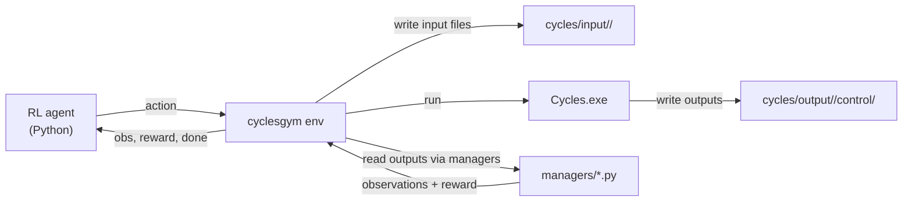

# Repo Overview and Architecture

High-level idea:
- This repo wraps the Cycles crop growth simulator in an OpenAI Gym-style API.
- You write RL code that calls `env.reset()` / `env.step(action)`.
- Under the hood, the environment generates Cycles input files, runs the simulator executable, then reads outputs to build observations and rewards.

Key folders:
- `cyclesgym/`: the Python gym wrapper (envs, managers, utils, policies)
- `cycles/`: Cycles simulator executable + input/output files
- `experiments/`: training scripts (stable-baselines3, W&B)
- `notebooks/`: example notebooks
- `documents/` and `documentation/`: existing user manual and project docs

Architecture map (system context):

Where the main logic lives:
- Environment lifecycle: `cyclesgym/envs/common.py`
- Fertilization env: `cyclesgym/envs/corn.py`
- Crop planning env: `cyclesgym/envs/crop_planning.py`
- File parsers (control/operation/weather/etc): `cyclesgym/managers/*.py`
- Weather generation: `cyclesgym/envs/weather_generator.py`
- Training: `experiments/fertilization/train.py`, `experiments/crop_planning/train.py`

Mental model:
- Think of Cycles as a "physics engine" for crops.
- `cyclesgym` is the "game engine wrapper" that exposes Cycles to RL.
- Actions modify management decisions (like fertilization or crop choice).
- Observations summarize weather, crop status, and soil conditions.
- Rewards convert farm outcomes into a scalar for RL optimization.
