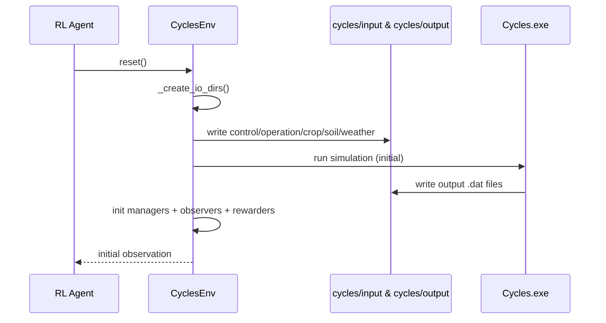
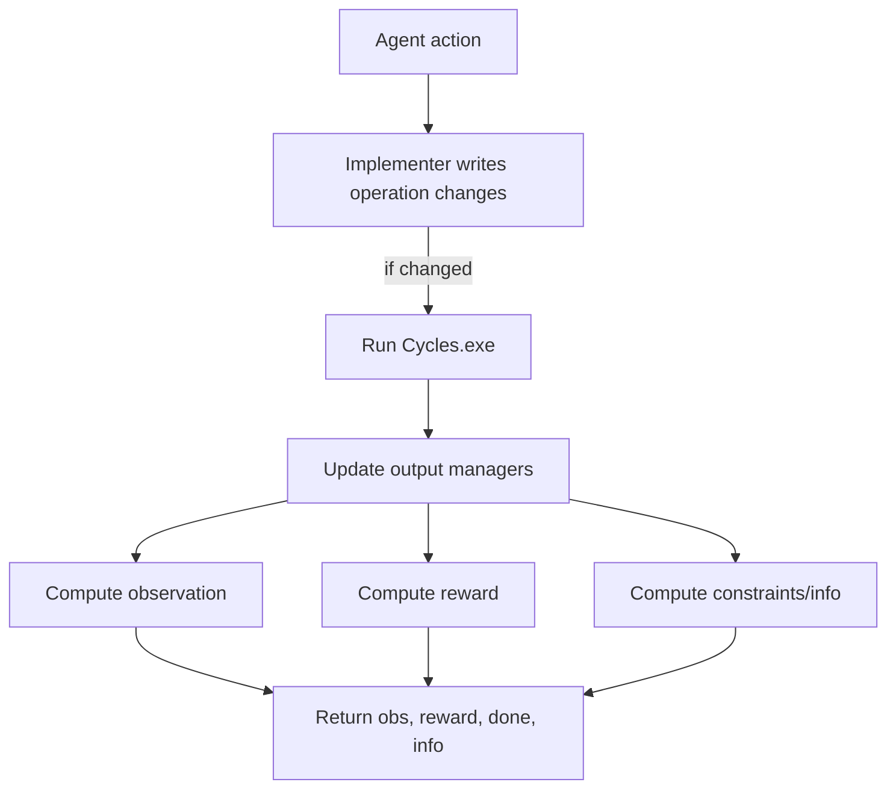

# Simulation Lifecycle (Reset + Step)

Key entry point:
- `cyclesgym/envs/common.py` defines the base class `CyclesEnv`.
- Specific envs like `Corn` and `CropPlanning` extend it.

## Reset flow (what happens at episode start)
`CyclesEnv._common_reset()` builds a complete temporary simulation workspace and runs Cycles once.

## Step flow (what happens per action)
`Corn.step()` in `cyclesgym/envs/corn.py` is the best example to read.

## Why Cycles is run during step
Cycles is an external simulator. It does not update state incrementally in memory.
So when an action changes the management plan, the env re-runs Cycles to get new outputs.

## Real-life analogy
Think of it like updating a spreadsheet model:
- You change a few input cells (fertilizer amount).
- The spreadsheet recalculates all outputs (yield, soil N).
- You then read the outputs to decide the next action.
