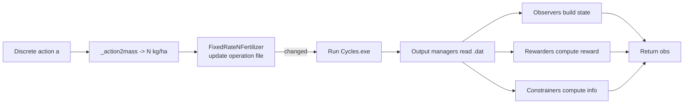

# Fertilization Environment Flow (Corn)

Primary file:
- `cyclesgym/envs/corn.py`

What the agent controls:
- The action is a discrete index that maps to a nitrogen mass (kg/ha).
- The env applies that fertilization to the current date.

Observation components:
- Weather (from `WeatherObserver`)
- Crop state (from `CropObserver`)
- Nitrogen-to-date (from `NToDateObserver`)

Reward components:
- Harvest profit (from `CropRewarder`)
- Fertilizer cost penalty (from `NProfitabilityRewarder`)

Constraints:
- Total N budget
- Max fertilization events
- N leaching constraints

Flow diagram:

Real-life example:
- You are a farm manager deciding how much nitrogen to apply each week.
- Applying more nitrogen can increase yield but also costs money and can leach into groundwater.
- The env balances "more yield" vs "more cost" using reward functions.

Code map:
- Action mapping: `cyclesgym/envs/corn.py:_action2mass`
- Implementer: `cyclesgym/envs/implementers.py:FixedRateNFertilizer`
- Observers: `cyclesgym/envs/observers.py`
- Rewarders: `cyclesgym/envs/rewarders.py`
- Constraints: `cyclesgym/envs/constrainers.py`
