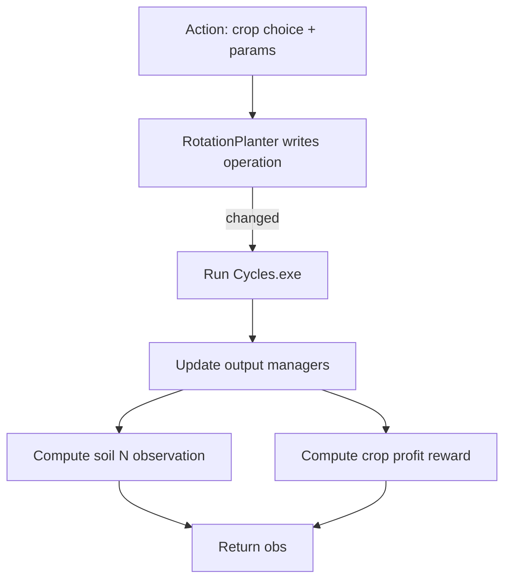

# Crop Planning Environment Flow

Primary file:
- `cyclesgym/envs/crop_planning.py`

What the agent controls:
- Crop choice for each year (rotation decision).
- Optional planting date and other parameters (depends on env variant).

Action space:
- `CropPlanning`: `MultiDiscrete([n_crops, 14, 10, 10])`
- `CropPlanningFixedPlanting`: `MultiDiscrete([n_crops, 14])`

Observation:
- Soil nitrogen summary from `SoilNObserver`, or a rotation window observer in a variant.

Reward:
- Sum of crop profits across the rotation (harvest rewards for selected crops).

Flow diagram:

Real-life example:
- You manage a farm with limited soil nutrients.
- You choose a crop each year (e.g., corn vs soybean).
- Crop rotations can improve soil health or reduce fertilizer needs.

Code map:
- Env class: `cyclesgym/envs/crop_planning.py`
- Implementer: `cyclesgym/envs/implementers.py:RotationPlanter`
- Observer: `cyclesgym/envs/observers.py:SoilNObserver`
- Rewarder: `cyclesgym/envs/rewarders.py:CropRewarder`
