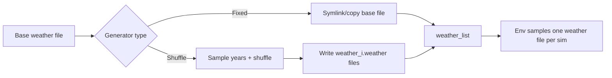

# Weather Generation Flow

Primary file:
- `cyclesgym/envs/weather_generator.py`

Two modes:
1) Fixed weather: use one weather file as-is.
2) Shuffled weather: sample years from a historical file and shuffle them to create new sequences.

Why this exists:
- To test policies across varied climate conditions.
- To prevent overfitting to a single historical sequence.

Flow diagram:

Real-life example:
- You train a policy on weather from 1980-2010.
- Shuffling creates "new" sequences that still look realistic.
- This is like training a driver on many different traffic patterns, not just one commute.

Code map:
- Generator base class: `cyclesgym/envs/weather_generator.py:WeatherGenerator`
- Fixed: `FixedWeatherGenerator`
- Shuffle: `WeatherShuffler`
