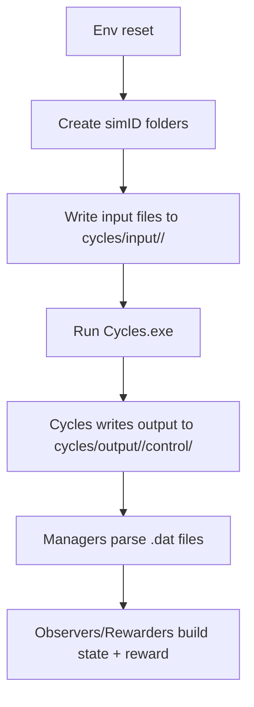

# Data Files and I/O Map

The environment uses real Cycles input/output files on disk.
Each simulation run gets its own temporary folder under `cycles/input/` and `cycles/output/`.

Important input files:
- `control.ctrl`: master config (years, output flags, file paths)
- `operation.operation`: management actions (planting, fertilization, irrigation)
- `weather.weather`: daily weather records
- `soil.soil`: soil profile
- `crop.crop`: crop parameters

Important output files (examples):
- `season.dat`: harvest events and yields
- `N.dat`: nitrogen pools and leaching
- `CornRM.90.dat`: crop growth time series

Path helper:
- `cyclesgym/utils/paths.py` defines `CYCLES_PATH` and `CYCLES_EXE`.

I/O lifecycle diagram:

Real-life example:
- Think of this as running a batch job with "input config files".
- The simulator writes CSV-like outputs, which the Python code reads.

Code map:
- Input/output setup: `cyclesgym/envs/common.py:_create_*`
- Managers that parse files: `cyclesgym/managers/*.py`
