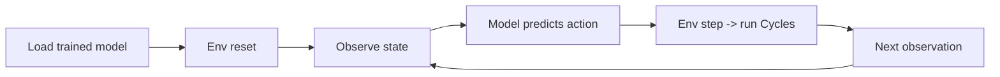

# Farmer Usage Guide (Practical Workflow)

This repo is a simulator-based decision support tool, not a live farm controller.
A farmer (or agronomist) can use it to test management strategies before applying them in the field.

## What data is needed (minimum)
You need Cycles input files for your location/crop:
- Weather: daily records (`*.weather`)
- Soil profile: soil properties (`*.soil`)
- Crop parameters: crop traits (`*.crop`)
- Operations: baseline management plan (`*.operation`)
- Control file: simulation setup (`*.ctrl`)

These are the same file types already in `cycles/input/`.

## Two common usage modes

### Mode A: Scenario testing (no training)
Goal: compare a few manual strategies.

Workflow:
1) Create or edit an environment (e.g., `Corn`).
2) Run a fixed policy (e.g., "apply 50 kg/ha N at week 15").
3) Observe yield, cost, and constraints.
4) Compare multiple strategies.

This is like running "what-if" simulations.

### Mode B: Train a policy (RL)
Goal: learn an adaptive strategy that reacts to weather/state.

Workflow:
1) Prepare historical weather and soil files for your location.
2) Update prices in `cyclesgym/utils/pricing_utils.py` if needed.
3) Run the training scripts (e.g., `experiments/fertilization/train.py`).
4) Evaluate on holdout weather years.
5) Save the policy model and normalization stats.

## How inference works (after training)
Inference is just running the env with a trained model:
- The model observes state (weather, crop, soil summaries).
- It outputs an action each step.
- The env runs Cycles and returns the next observation.

Typical flow:

You can run a full season once to get a complete management plan and outcomes.

## What does "using it on a farm" mean here?
Think of it as a decision lab:
- You do not deploy the simulator on a tractor.
- You use it to test strategies and understand trade-offs.
- Final decisions still require agronomic judgment.

## Practical checklist
- Confirm your weather file has the right years and format.
- Confirm soil and crop files match the region/cultivar.
- Decide whether you are doing fertilization or crop planning.
- Start with fixed weather to validate results.
- Use shuffled weather to stress-test the policy.

## Quick mapping to repo
- Inputs: `cycles/input/`
- Env classes: `cyclesgym/envs/`
- Training: `experiments/*/train.py`
- Outputs: `cycles/output/<simID>/control/`
