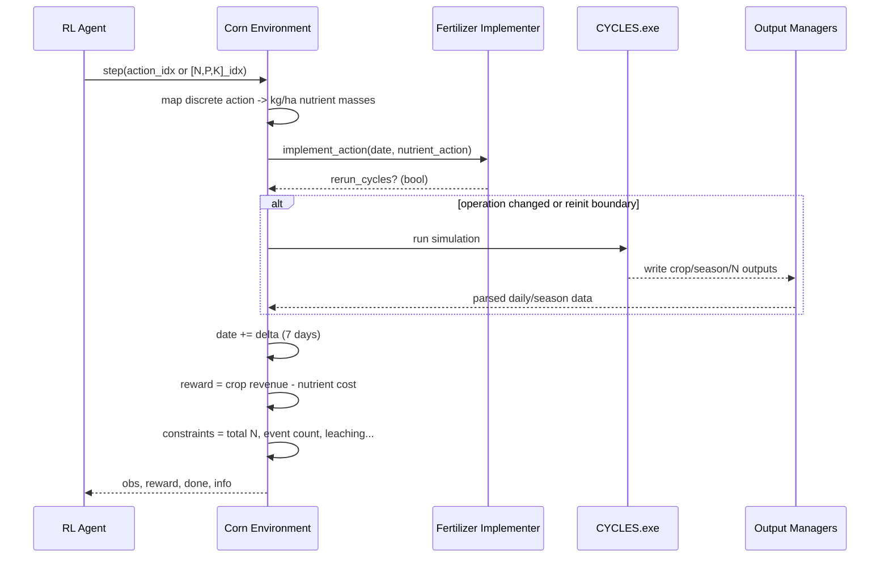
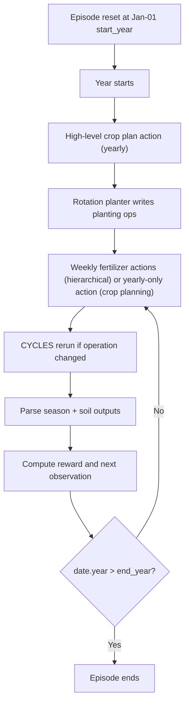
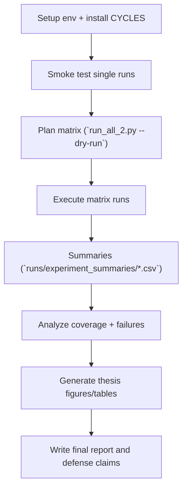

# 0) Overall and Detailed Flow Diagrams

## A. Overall Updated System Flow

```mermaid
flowchart LR
    A["CLI Runner (`run_all_2.py`)"] --> B["Train Script<br/>fertilization or crop planning"]
    B --> C["Env Factory (`env_maker`)"]
    C --> D["CYCLES Env (`Corn` / `CropPlanning` / `Hierarchical...`)"]
    D --> E["Action Implementers<br/>fertilizer + planting"]
    E --> F["CYCLES Simulator"]
    F --> G["Output Managers<br/>crop/season/soil/weather"]
    G --> H["Observer + Rewarder + Constrainer"]
    H --> I["SB3 Model<br/>PPO/A2C/DQN"]
    I --> J["Eval Callbacks<br/>train/test det/sto"]
    J --> K["W&B + JSONL Logs + Summary JSON/CSV"]
```

## B. Fertilization Step-Level Flow (Detailed)

## C. Crop Planning + Hierarchical Decision Flow

## D. Full Experimentation Pipeline

