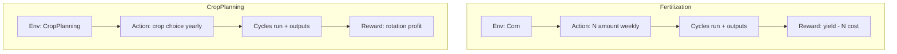

# Training vs Inference: Fertilization vs Crop Planning

This repo has two main task families:
1) Fertilization control (short-term, within a season).
2) Crop planning / rotation (long-term, across years).

They are separate environments and are usually trained separately.
They share the same simulator (Cycles) and the same data pipeline, but the actions,
state, and reward design are different.

## Are they trained separately?
Yes, in practice they are trained separately.
- Fertilization uses `cyclesgym/envs/corn.py` and scripts in `experiments/fertilization/`.
- Crop planning uses `cyclesgym/envs/crop_planning.py` and scripts in `experiments/crop_planning/`.

Why separate:
- Action spaces are different (weekly N amount vs yearly crop choice).
- Time scales are different (weekly steps vs yearly steps).
- Reward logic is different (fertilizer cost + crop yield vs rotation profit).

## How are they related economically?
Both tasks are framed as economic optimization:
- Fertilization: maximize profit = yield value minus nitrogen cost.
- Crop planning: maximize profit across a crop rotation (sum of harvest value).

In both cases, the reward is the economic signal:
- Fertilization adds a cost term (`NProfitabilityRewarder`).
- Both use `CropRewarder` for harvest revenue.

## Do you use both in a single model at inference?
Not by default.
The repo treats them as different tasks, so inference is different too:
- Fertilization inference: pick N amount each step of a season.
- Crop planning inference: pick crop (and possibly planting params) each year.

If you wanted a combined system in the future, it would look like:
- A higher-level planner chooses the crop for each year.
- A lower-level controller chooses weekly fertilization within that year.
This is a multi-scale decision problem and would need custom glue code.

## Overall flow comparison

## Where to look in code
- Fertilization env: `cyclesgym/envs/corn.py`
- Crop planning env: `cyclesgym/envs/crop_planning.py`
- Fertilization training: `experiments/fertilization/train.py`
- Crop planning training: `experiments/crop_planning/train.py`
- Reward logic: `cyclesgym/envs/rewarders.py`
